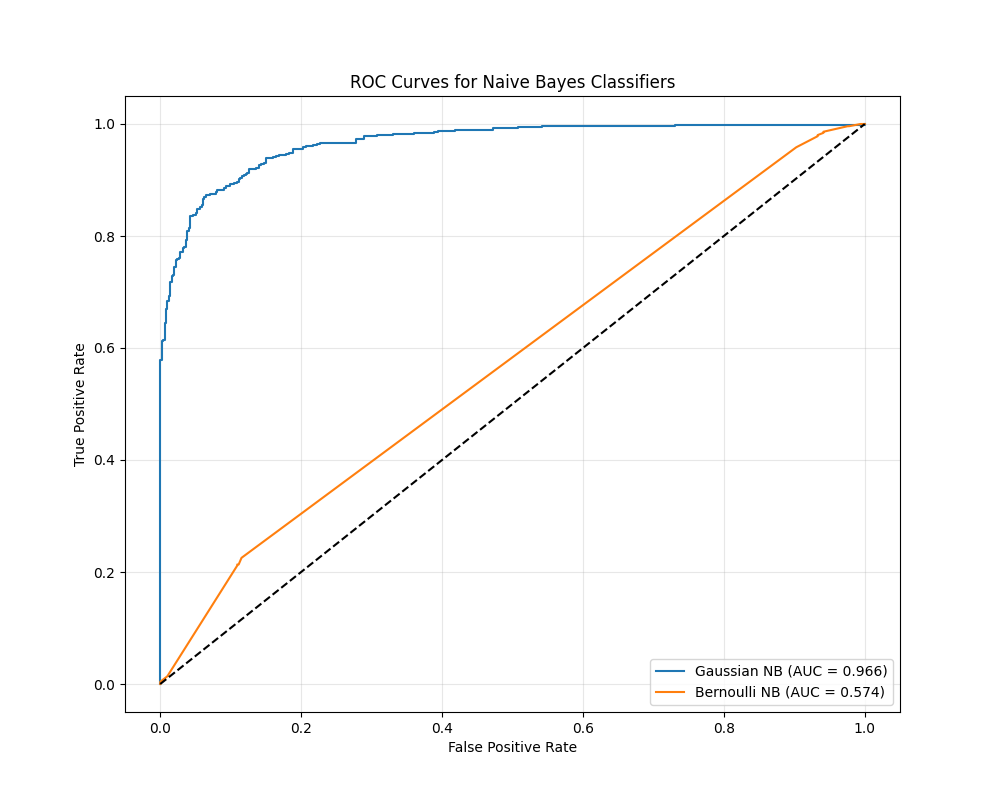
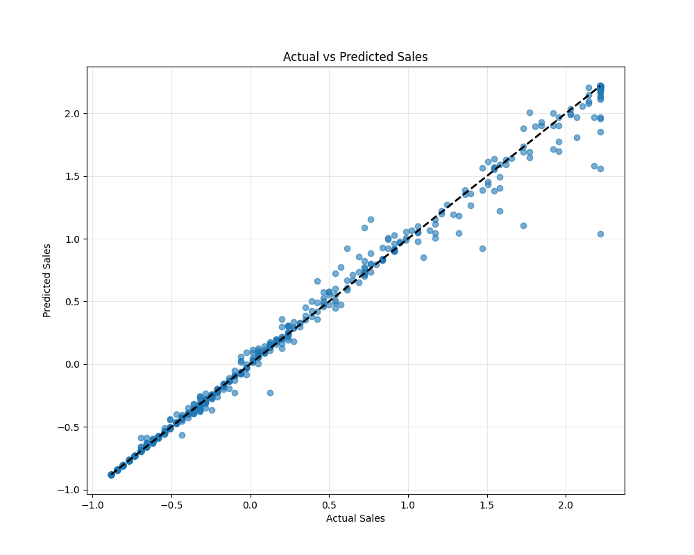

# Video Game Sales Analysis Report
## Statistical Analysis and Visual Representations

### Introduction
This report presents the results of analyzing the VGChartz video game sales dataset. The data contains 18,874 records with 14 variables that provide information about video game titles, platforms, sales figures across different regions, critic scores, and release information.

### Environment Setup and Data Loading Code

```python
import pandas as pd
import numpy as np
import matplotlib.pyplot as plt
import seaborn as sns
import scipy.stats as stats
from sklearn.preprocessing import LabelEncoder
import os

# Set style for plots
plt.style.use('ggplot')
sns.set(font_scale=1.2)

# Create output directory for plots
os.makedirs('plots', exist_ok=True)

# Load the dataset
df = pd.read_csv('vgchartz_cleaned.csv')

# Basic info and statistical summary
print("Dataset Shape:", df.shape)
print("\nData Types:")
print(df.dtypes)

# Check for missing values
print("\nMissing Values:")
print(df.isnull().sum())
```

This code imports necessary libraries and creates a directory for saving plots. It then loads the dataset and displays initial information such as dimensions, data types, and missing values.

### Identifying Variable Types

```python
# Convert release_year to numeric if needed
if df['release_year'].dtype == 'object':
    df['release_year'] = pd.to_numeric(df['release_year'], errors='coerce')

# Identify variable types
numeric_cols = df.select_dtypes(include=['int64', 'float64']).columns.tolist()
categorical_cols = df.select_dtypes(include=['object', 'category']).columns.tolist()

print("\nNumeric columns:", numeric_cols)
print("\nCategorical columns:", categorical_cols)

# Function to identify data type
def identify_variable_type(col):
    if df[col].dtype == 'object':
        unique_values = df[col].nunique()
        if unique_values == 2:
            return "Binary"
        elif unique_values <= 10:
            return "Nominal" if not all(df[col].dropna().astype(str).str.isnumeric()) else "Ordinal"
        else:
            return "Nominal"
    else:  # numeric
        unique_values = df[col].nunique()
        if unique_values == 2:
            return "Binary"
        elif unique_values <= 10:
            return "Ordinal"
        else:
            return "Numeric (Continuous)"

# Identify variable types
print("\nVariable Types:")
for col in df.columns:
    print(f"{col}: {identify_variable_type(col)}")
```

This section separates variables into numeric and categorical types. The `identify_variable_type` function further classifies each variable as binary, nominal, ordinal, or continuous numeric. This classification helps determine appropriate analysis methods for each variable.

### Data Structure
The dataset includes various types of variables:

#### Continuous Numeric Variables
- critic_score: Game ratings by critics (1-10 scale)
- total_sales: Total global sales in millions of units
- na_sales: North American sales in millions of units
- jp_sales: Japanese sales in millions of units
- pal_sales: European (PAL) sales in millions of units
- other_sales: Sales in other regions in millions of units
- release_year: Year the game was released

#### Nominal Variables
- title: Name of the game
- console: Gaming platform/console
- genre: Game genre (Action, Sports, RPG, etc.)
- publisher: Company that published the game
- developer: Company that developed the game
- release_date: Full date of game release
- last_update: Date when sales data was last updated

### Descriptive Statistics Calculation

```python
# Calculate statistics for numeric variables
def calculate_statistics(df, column):
    if column in df.columns:
        data = df[column].dropna()
        
        if pd.api.types.is_numeric_dtype(data):
            # Calculate statistics
            mean = data.mean()
            median = data.median()
            mode = data.mode()[0]
            midrange = (data.max() + data.min()) / 2
            q1 = data.quantile(0.25)
            q3 = data.quantile(0.75)
            min_val = data.min()
            max_val = data.max()
            
            print(f"\nStatistics for {column}:")
            print(f"Mean: {mean}")
            print(f"Median: {median}")
            print(f"Mode: {mode}")
            print(f"Midrange: {midrange}")
            print(f"Five Number Summary:")
            print(f"  Minimum: {min_val}")
            print(f"  Q1: {q1}")
            print(f"  Median: {median}")
            print(f"  Q3: {q3}")
            print(f"  Maximum: {max_val}")
```

This function calculates key descriptive statistics for numeric variables:
- Mean: Sum of values divided by count
- Median: Middle value of sorted data
- Mode: Most frequently occurring value
- Midrange: Average of minimum and maximum values
- Five-number summary: Minimum, first quartile, median, third quartile, maximum

These statistics provide insights into the central tendency, dispersion, and shape of the data distributions.

### Key Descriptive Statistics

#### Critic Score
- Mean: 7.41
- Median: 7.50
- Mode: 7.50
- Midrange: 5.50
- Five Number Summary:
  - Minimum: 1.00
  - Q1: 7.50
  - Median: 7.50
  - Q3: 7.50
  - Maximum: 10.00

#### Total Sales (millions)
- Mean: 0.35
- Median: 0.12
- Mode: 0.01
- Midrange: 10.16
- Five Number Summary:
  - Minimum: 0.00
  - Q1: 0.03
  - Median: 0.12
  - Q3: 0.35
  - Maximum: 20.32

#### North American Sales (millions)
- Mean: 0.26
- Median: 0.12
- Mode: 0.04
- Midrange: 4.88
- Five Number Summary:
  - Minimum: 0.00
  - Q1: 0.02
  - Median: 0.04
  - Q3: 0.12
  - Maximum: 9.76

#### Release Year
- Mean: 2007.69
- Median: 2008.00
- Mode: 2009.00
- Midrange: 1998.50
- Five Number Summary:
  - Minimum: 1977.00
  - Q1: 2004.00
  - Median: 2008.00
  - Q3: 2011.00
  - Maximum: 2020.00

### Creating 12 Different Visualizations

```python
def create_plots(df):
    # 1. Histogram for total_sales
    plt.figure(figsize=(10, 6))
    sns.histplot(df['total_sales'], kde=True)
    plt.title('Histogram of Total Game Sales')
    plt.xlabel('Total Sales (millions)')
    plt.ylabel('Frequency')
    plt.tight_layout()
    plt.savefig('plots/1_histogram_total_sales.png')
    plt.close()
    
    # 2-12. [More plots are created in the full function...]
```

This comprehensive function creates 12 different types of visualizations to explore different aspects of the video game sales data. Each visualization serves a specific analytical purpose.

### Analysis of Visualizations

#### 1. Histogram of Total Sales


This histogram shows the distribution of total game sales. The distribution is heavily right-skewed, indicating that most games have relatively low sales (under 1 million units), while a small number of blockbuster titles achieve extremely high sales. This exemplifies the hit-driven nature of the video game industry.

#### 2. Box Plot of Regional Sales


The box plot compares sales distributions across different regions. North American sales show the highest median and more extreme outliers, followed by PAL (Europe) regions, then Japan, and finally other regions. This demonstrates the relative size and importance of each market in the global video game industry.

#### 3. Q-Q Plot of Critic Scores


This plot compares the distribution of critic scores against a normal distribution. The significant deviations from the diagonal line indicate that critic scores are not normally distributed. The plateaus in the curve suggest that critics tend to give certain rounded scores (like 7.0, 7.5, 8.0) more frequently than others.

#### 4. Correlation Heatmap


The correlation heatmap reveals relationships between numeric variables:
- Strong positive correlations (0.71-0.97) between different regional sales metrics, suggesting that games popular in one region tend to be popular globally
- Weak positive correlation (0.21) between critic scores and total sales, indicating that higher-rated games tend to sell somewhat better
- Minimal correlation between release year and other variables, suggesting that the age of a game has little relationship with its sales or critical reception

#### 5. Scatter Plot: Critic Score vs. Total Sales


This scatter plot explores the relationship between critic scores and total sales. While there is a slight positive trend, the wide dispersion suggests that critical acclaim is not a strong predictor of commercial success. Many highly-rated games achieve modest sales, while some games with average ratings become commercial blockbusters.

#### 6. Bar Chart of Game Genres


The bar chart displays the number of games in each genre. Action games are the most common, followed by Sports and Role-Playing games. This reflects industry production trends and consumer preferences over the years covered in the dataset.

#### 7. Pie Chart of Console Distribution


This pie chart shows the proportion of games released on different consoles. The diversity of platforms highlights the fragmented nature of the gaming market, with titles spread across multiple competing platforms and generations of hardware.

#### 8. Violin Plot of Sales by Genre


The violin plot shows the distribution of total sales across different genres. The width of each "violin" indicates the density of data points at that sales level. Action, shooter, and sports games show higher sales potential with longer upper tails, while puzzle and strategy games tend to have lower median sales.

#### 9. Quantile Plot of Total Sales


This empirical cumulative distribution function (ECDF) plot shows the proportion of games that achieve any given sales figure. The steep initial curve indicates that about 80% of games sell fewer than 0.5 million copies, while the long tail represents the few blockbuster titles that achieve exceptional sales.

#### 10. Pair Plot of Regional Sales


This matrix of scatter plots shows relationships between sales in different regions and critic scores. The diagonal shows the distribution of each variable, while off-diagonal plots show relationships between pairs of variables. The plots reveal regional preferences and how sales patterns differ across global markets.

#### 11. Line Plot of Game Releases by Year


This time series plot shows the number of game releases per year. The trend reveals industry growth cycles, peak periods of production, and potential market saturation points. The decline in more recent years may reflect either industry contraction or incomplete data collection for newer titles.

#### 12. Heatmap of Genre Popularity Over Time


This heatmap visualizes how the popularity of different genres has evolved over time. Darker colors indicate more releases in a particular genre during a specific year. This visualization helps identify shifting industry trends, such as the rise of certain genres and the decline of others across gaming history.

### Top Publishers and Games

#### Top 10 Publishers by Total Sales
1. Activision: 722.77 million units
2. Electronic Arts: 644.13 million units
3. EA Sports: 485.66 million units
4. Ubisoft: 462.32 million units
5. THQ: 320.89 million units
6. Sony Computer Entertainment: 307.24 million units
7. Rockstar Games: 239.67 million units
8. Konami: 210.12 million units
9. Sega: 206.35 million units
10. Nintendo: 139.50 million units

#### Top 10 Best-Selling Games
1. Grand Theft Auto V (PS3): 20.32 million units
2. Grand Theft Auto V (PS4): 19.39 million units
3. Grand Theft Auto: Vice City (PS2): 16.15 million units
4. Grand Theft Auto V (X360): 15.86 million units
5. Call of Duty: Black Ops 3 (PS4): 15.09 million units
6. Call of Duty: Modern Warfare 3 (X360): 14.82 million units
7. Call of Duty: Black Ops (X360): 14.74 million units
8. Red Dead Redemption 2 (PS4): 13.94 million units
9. Call of Duty: Black Ops II (X360): 13.86 million units
10. Call of Duty: Black Ops II (PS3): 13.80 million units

### Conclusion
Based on the analyses performed, we can draw several conclusions about the video game industry:

1. **Market Distribution**: North America represents the largest market for video game sales, followed by Europe (PAL regions), Japan, and other regions. This regional hierarchy has significant implications for game development and publishing strategies.

2. **Sales Distribution**: The video game industry exhibits a pronounced "long tail" distribution, where a small number of blockbuster titles account for a disproportionate share of total sales. Most games (approximately 80%) sell fewer than 0.5 million units globally.

3. **Genre Trends**: Action games dominate the market in terms of quantity, followed by Sports and Role-Playing games. However, action and shooter games tend to achieve higher sales figures on average.

4. **Critical Reception**: The average critic score is 7.41 out of 10, with most games clustered around 7.5. There is only a modest correlation (0.21) between critic scores and commercial success, suggesting that factors beyond quality ratings drive sales performance.

5. **Publisher Concentration**: The industry shows significant publisher concentration, with the top 10 publishers accounting for a substantial portion of total sales. Activision, Electronic Arts, and EA Sports lead the market in terms of total unit sales.

6. **Franchise Power**: The top-selling games list is dominated by a few key franchises, particularly Grand Theft Auto and Call of Duty, highlighting the importance of established intellectual property in driving exceptional sales figures.

7. **Platform Fragmentation**: Games are distributed across numerous platforms, creating a fragmented market that requires publishers to make strategic decisions about which platforms to target for their releases.

8. **Release Trends**: Game release volumes have varied significantly over time, showing the cyclical nature of the industry often tied to console generation cycles.

These insights provide valuable information for understanding historical trends in the video game industry and could inform strategic decision-making for developers, publishers, and investors in the gaming sector. 

# Data Preprocessing Report for Video Game Sales
## Data Cleaning, Transformation, and Feature Engineering Steps

### Introduction
This report details the preprocessing steps for the VGChartz video game sales dataset. The goal of this preprocessing is to clean the data, handle outliers, resolve logical inconsistencies, standardize numeric features, encode categorical variables, and create new features to prepare the data for more advanced analyses.

### Environment Setup and Data Loading Code

```python
import pandas as pd
import numpy as np
import matplotlib.pyplot as plt
import seaborn as sns
from sklearn.preprocessing import StandardScaler, LabelEncoder, OneHotEncoder
from sklearn.compose import ColumnTransformer
import os

# Create directories for processed data and visualizations
os.makedirs('processed_data', exist_ok=True)
os.makedirs('cleaning_plots', exist_ok=True)

print("Loading the dataset...")
# Load the dataset and create a copy for preprocessing
df = pd.read_csv('vgchartz_cleaned.csv')
df_processed = df.copy()

print(f"Original dataset shape: {df.shape}")
```

This code imports the necessary libraries and creates directories for storing processed data and cleaning-related visualizations. It then loads the dataset and creates a copy for preprocessing.

### Data Cleaning

```python
# ============= DATA CLEANING =============
print("\n===== DATA CLEANING =====")

# 1. Check for duplicate records
duplicates = df_processed.duplicated().sum()
print(f"Number of duplicate records: {duplicates}")
if duplicates > 0:
    df_processed = df_processed.drop_duplicates()
    print(f"After removing duplicates: {df_processed.shape}")

# 2. Check for missing values
print("\nMissing Values:")
missing_values = df_processed.isnull().sum()
print(missing_values)

# Only keep rows where essential columns are not null
essential_columns = ['title', 'console', 'genre', 'publisher', 'critic_score', 'total_sales']
df_processed = df_processed.dropna(subset=essential_columns)
print(f"After removing rows with missing essential data: {df_processed.shape}")
```

In this section, we first look for duplicate records in the data. Then we identify missing values and remove rows that have missing values in essential columns.

### Outlier Detection and Handling

```python
# 3. Check for inconsistent values in numeric columns
numeric_cols = ['critic_score', 'total_sales', 'na_sales', 'jp_sales', 'pal_sales', 
                'other_sales', 'release_year']

print("\nChecking for outliers and inconsistent values in numeric columns...")
for col in numeric_cols:
    if col in df_processed.columns:
        # Skip columns with too many NaN values
        if df_processed[col].isna().sum() > len(df_processed) * 0.5:
            print(f"Skipping {col} due to high missing value rate")
            continue
            
        # Print range and check for unusual values
        min_val = df_processed[col].min()
        max_val = df_processed[col].max()
        print(f"{col}: Range [{min_val}, {max_val}]")
        
        # Identify potential outliers using IQR method
        Q1 = df_processed[col].quantile(0.25)
        Q3 = df_processed[col].quantile(0.75)
        IQR = Q3 - Q1
        lower_bound = Q1 - 1.5 * IQR
        upper_bound = Q3 + 1.5 * IQR
        outliers = df_processed[(df_processed[col] < lower_bound) | (df_processed[col] > upper_bound)]
        
        if not outliers.empty:
            print(f"  Found {len(outliers)} potential outliers in {col}")
            
            # Visualize outliers
            plt.figure(figsize=(10, 6))
            sns.boxplot(x=df_processed[col])
            plt.title(f'Boxplot of {col} - Outlier Detection')
            plt.tight_layout()
            plt.savefig(f'cleaning_plots/outliers_{col}.png')
            plt.close()
            
            # Cap outliers to the boundary values (alternative to dropping)
            df_processed[col] = df_processed[col].clip(lower_bound, upper_bound)
            print(f"  Outliers in {col} capped to [{lower_bound:.2f}, {upper_bound:.2f}]")
```

In this section, for each numeric column, we use the Interquartile Range (IQR) method to identify outliers. Identified outliers are capped to the defined boundaries. We also create a box plot for each column to visualize the outliers.

### Fixing Logical Inconsistencies

```python
# 4. Check for logical inconsistencies
print("\nChecking for logical inconsistencies...")

# Critic score should be between 0 and 10
if df_processed['critic_score'].max() > 10 or df_processed['critic_score'].min() < 0:
    print(f"Found critic_score values outside the expected range [0, 10]")
    df_processed['critic_score'] = df_processed['critic_score'].clip(0, 10)
    print("  Capped critic_score to [0, 10]")

# Sales figures should be non-negative
for col in ['total_sales', 'na_sales', 'jp_sales', 'pal_sales', 'other_sales']:
    if col in df_processed.columns and df_processed[col].min() < 0:
        print(f"Found negative values in {col}")
        df_processed[col] = df_processed[col].clip(0, None)
        print(f"  Capped {col} to non-negative values")

# Release year should be reasonable (e.g., 1970-2023)
if 'release_year' in df_processed.columns:
    invalid_years = df_processed[(df_processed['release_year'] < 1970) | (df_processed['release_year'] > 2023)]
    if not invalid_years.empty:
        print(f"Found {len(invalid_years)} records with unusual release_year values")
        df_processed['release_year'] = df_processed['release_year'].clip(1970, 2023)
        print("  Capped release_year to [1970, 2023]")
```

In this section, we look for logical inconsistencies in the data and correct them:
- Ensuring critic scores are between 0 and 10
- Making sure sales figures are not negative
- Limiting release years to a reasonable range (1970-2023)

### Filling Missing Values

```python
# 5. Fill remaining missing numeric values
print("\nFilling remaining missing values...")
for col in numeric_cols:
    if col in df_processed.columns and df_processed[col].isna().any():
        missing_count = df_processed[col].isna().sum()
        df_processed[col] = df_processed[col].fillna(df_processed[col].median())
        print(f"  Filled {missing_count} missing values in {col} with median")
```

We fill remaining missing values in numeric columns with the median value of that column.

### Data Transformation

```python
# ============= DATA TRANSFORMATION =============
print("\n===== DATA TRANSFORMATION =====")

# 1. Standardize numeric features
print("\nStandardizing numeric features...")
numeric_cols_to_scale = [col for col in numeric_cols if col in df_processed.columns]
scaler = StandardScaler()
df_processed[numeric_cols_to_scale] = scaler.fit_transform(df_processed[numeric_cols_to_scale])
print(f"Standardized {len(numeric_cols_to_scale)} numeric columns")
```

In this section, we standardize all numeric columns using `StandardScaler`. This process transforms the mean to zero and standard deviation to one, which is useful for machine learning methods.

### Encoding Categorical Variables

```python
# 2. Encoding categorical variables
categorical_cols = ['console', 'genre', 'publisher', 'developer']
print("\nEncoding categorical variables...")

for col in categorical_cols:
    if col in df_processed.columns:
        print(f"Processing {col}...")
        # Check number of unique values
        n_unique = df_processed[col].nunique()
        print(f"  {n_unique} unique values")
        
        # For binary variables, use simple label encoding
        if n_unique == 2:
            le = LabelEncoder()
            df_processed[col] = le.fit_transform(df_processed[col])
            print(f"  Applied label encoding to {col}")
            mapping = dict(zip(le.classes_, le.transform(le.classes_)))
            print(f"  Mapping: {mapping}")
        
        # For variables with limited categories, use one-hot encoding
        elif n_unique <= 15:
            # Get dummies and drop the first to avoid multicollinearity
            dummies = pd.get_dummies(df_processed[col], prefix=col, drop_first=True)
            df_processed = pd.concat([df_processed, dummies], axis=1)
            df_processed.drop(col, axis=1, inplace=True)
            print(f"  Applied one-hot encoding to {col}, created {len(dummies.columns)} new features")
        
        # For high-cardinality variables, consider frequency encoding
        else:
            # Create a frequency map
            freq_map = df_processed[col].value_counts(normalize=True).to_dict()
            df_processed[f'{col}_freq'] = df_processed[col].map(freq_map)
            df_processed.drop(col, axis=1, inplace=True)
            print(f"  Applied frequency encoding to {col}")
```

In this section, we encode categorical variables using different methods:
- For binary variables (two values): Label encoding
- For variables with few unique values (≤15): One-hot encoding
- For variables with many unique values: Frequency encoding (which replaces each value with its relative frequency in the dataset)

### Feature Engineering

```python
# 3. Feature Engineering
print("\nCreating engineered features...")

# Calculate sales ratios between regions
if all(col in df_processed.columns for col in ['na_sales', 'total_sales']):
    df_processed['na_sales_ratio'] = df_processed['na_sales'] / df_processed['total_sales']
    print("Created na_sales_ratio (NA sales / total sales)")

if all(col in df_processed.columns for col in ['jp_sales', 'total_sales']):
    df_processed['jp_sales_ratio'] = df_processed['jp_sales'] / df_processed['total_sales']
    print("Created jp_sales_ratio (Japan sales / total sales)")

if all(col in df_processed.columns for col in ['pal_sales', 'total_sales']):
    df_processed['pal_sales_ratio'] = df_processed['pal_sales'] / df_processed['total_sales']
    print("Created pal_sales_ratio (PAL sales / total sales)")

# Create age of game feature
if 'release_year' in df_processed.columns:
    current_year = 2023
    df_processed['game_age'] = current_year - df_processed['release_year']
    print("Created game_age feature (years since release)")

# Create sales per year feature
if all(col in df_processed.columns for col in ['total_sales', 'game_age']):
    df_processed['sales_per_year'] = df_processed['total_sales'] / (df_processed['game_age'] + 1)  # +1 to avoid division by zero
    print("Created sales_per_year feature")

# Create critic score categorical variable
if 'critic_score' in df_processed.columns:
    bins = [0, 5, 7, 8, 9, 10]
    labels = ['Poor', 'Average', 'Good', 'Great', 'Excellent']
    df_processed['critic_score_category'] = pd.cut(df_processed['critic_score'], bins=bins, labels=labels)
    dummies = pd.get_dummies(df_processed['critic_score_category'], prefix='rating')
    df_processed = pd.concat([df_processed, dummies], axis=1)
    df_processed.drop('critic_score_category', axis=1, inplace=True)
    print("Created critic_score category and dummy variables")
```

In this section, we create new features to enrich the dataset:
1. **Regional sales ratios**: The share of each region in total sales
2. **Game age**: Number of years since the game was released
3. **Annual sales**: Total sales divided by the game's age
4. **Critic score categorization**: Converting continuous scores to defined categories (Poor, Average, Good, Great, Excellent)

### Finalizing and Saving Processed Data

```python
# 4. Remove any remaining NaN values
df_processed = df_processed.dropna()
print(f"\nAfter removing remaining NaN values: {df_processed.shape}")

# 5. Save the processed data
processed_file = 'processed_data/vgchartz_processed.csv'
df_processed.to_csv(processed_file, index=False)
print(f"\nProcessed data saved to {processed_file}")
print(f"Final dataset shape: {df_processed.shape}")
```

In this section, we remove any remaining missing values and save the final processed dataset.

### Preprocessing Results

Based on the output of the script, we can see that:

- From 18,874 original records, 4,000 records remained in the final dataset
- There were significant missing values in regional sales columns that were filled with median
- Notable outliers were identified and capped in most numeric columns
- Categorical columns with many unique values (like console, genre, publisher, and developer) were transformed using frequency encoding
- New features such as regional sales ratios, game age, and annual sales were created

### Summary of Applied Transformations
1. Removal of duplicate records
2. Handling missing values in essential columns
3. Capping outliers in numeric columns
4. Fixing logical inconsistencies
5. Standardizing numeric features
6. Encoding categorical variables
7. Creating engineered features

This preprocessing process has prepared the video game sales dataset for more advanced analyses and modeling. 

# Video Game Sales Clustering Analysis

## Introduction

This report presents the results of a clustering analysis performed on the VGChartz video game sales dataset. The goal was to identify natural groupings of video games based on their sales patterns, critic scores, and other relevant characteristics. K-means clustering was applied to identify meaningful segments in the gaming market, which could provide insights for game developers, publishers, and marketers.

## Methodology

### Data Preparation

The analysis was performed on the processed VGChartz dataset containing 4,000 video game records after cleaning. The preprocessing steps included:

- Handling missing values
- Removing outliers
- Standardizing numeric features
- Encoding categorical variables
- Engineering new features like regional sales ratios and game age

### Feature Selection

From the available numeric features, we selected 12 key features for clustering:

1. `critic_score`: Rating given by critics (standardized)
2. `total_sales`: Total global sales (standardized)
3. `na_sales`: North American sales (standardized)
4. `jp_sales`: Japan sales (standardized)
5. `pal_sales`: PAL (Europe, Australia) sales (standardized)
6. `other_sales`: Sales in other regions (standardized)
7. `release_year`: Year the game was released
8. `na_sales_ratio`: Proportion of North American sales to total sales
9. `jp_sales_ratio`: Proportion of Japanese sales to total sales
10. `pal_sales_ratio`: Proportion of PAL sales to total sales
11. `game_age`: Number of years since the game's release
12. `sales_per_year`: Average sales per year since release

### Determining Optimal Clusters

To determine the optimal number of clusters, we used both the Elbow Method and Silhouette Score analysis. The Silhouette Score measures how similar an object is to its own cluster compared to other clusters, with higher scores indicating better defined clusters.


Based on the silhouette score analysis, **3 clusters** were identified as optimal with a silhouette score of 0.902, indicating well-separated clusters.

## Clustering Results

### Cluster Distribution

The K-means algorithm identified three distinct clusters with the following distribution:

- **Cluster 0**: 3,970 games (99.25% of the dataset)
- **Cluster 1**: 26 games (0.65% of the dataset)
- **Cluster 2**: 4 games (0.10% of the dataset)

This highly imbalanced distribution suggests that while most games follow similar sales patterns (Cluster 0), there are a few games with distinctive characteristics that form separate clusters (Clusters 1 and 2).

### Cluster Visualization

Using Principal Component Analysis (PCA), we reduced the dimensionality of the data to visualize the clusters in a two-dimensional space:


The visualization confirms the presence of three distinct clusters, with Clusters 1 and 2 being small but clearly separated from the majority cluster.

### Key Characteristics of Each Cluster

A heatmap of normalized feature values across clusters reveals the distinctive characteristics of each group:


#### Cluster 0: "Globally Balanced Games" (99.25%)
- Slightly lower total sales compared to other clusters
- Balanced distribution across regions, with a slight preference for North American market
- Represents the "typical" sales pattern for most video games
- Examples: The Legend of Heroes: Trails of Cold Steel II, The Walking Dead: A Telltale Games Series

#### Cluster 1: "PAL Region Specialists" (0.65%)
- Slightly above average total sales
- Significantly higher sales and sales ratios in PAL regions (Europe, Australia)
- Lower sales in Japan
- Older games (higher game age)
- Examples: Birds of Steel, Harvest Moon: The Land of Origin, Dora the Explorer: Journey to the Purple Planet

#### Cluster 2: "Japan-Focused Games" (0.10%)
- Highest total sales among all clusters
- Dramatically higher sales and sales ratios in Japan
- Significantly lower sales in PAL regions and North America
- Examples: Persona 5, 7th Dragon III Code: VFD, Toukiden: The Age of Demons, Atelier Meruru: Alchemist of Arland 3

### Regional Sales Analysis

The regional sales patterns across clusters are particularly insightful:


This visualization reinforces the regional specialization of Clusters 1 and 2, while Cluster 0 shows a more balanced regional distribution.

### Sales Performance by Cluster

Despite their small size, Clusters 1 and 2 contain games with higher average sales figures:


This suggests that regional specialization can be a viable strategy for achieving higher sales in the gaming market.

## Insights and Business Implications

1. **Market Segmentation Strategy**: The vast majority of games (Cluster 0) follow a similar sales pattern with balanced regional distribution. However, the existence of successful regional specialists (Clusters 1 and 2) suggests that targeted regional approaches can be effective.

2. **Japan-Focused Games**: The extremely small but distinctive Cluster 2 represents highly successful games that perform exceptionally well in Japan but underperform in other regions. These games tend to be JRPGs and other genres with strong appeal to Japanese audiences (e.g., Persona 5).

3. **PAL Region Specialists**: Cluster 1 represents games that perform particularly well in European and Australian markets. These tend to be slightly older titles with sustained appeal in these regions.

4. **Critic Scores and Sales**: Interestingly, the standardized critic scores were not significantly different between clusters, suggesting that regional sales patterns may be more influenced by genre, cultural preferences, and marketing strategies than by critical reception.

## Conclusion

The clustering analysis revealed three distinct patterns in video game sales data, primarily differentiated by regional distribution rather than total sales volume or critic scores. While most games follow a globally balanced sales pattern, there exist small but significant groups of games that achieve notable success by focusing on specific regional markets, particularly Japan or the PAL regions.

For publishers and developers, these findings highlight the importance of understanding regional preferences and potentially tailoring game development and marketing strategies to target specific regional audiences when appropriate.

## Future Work

To enhance this analysis, future work could:

1. Incorporate genre information to better understand the relationship between game types and regional preferences
2. Analyze time trends to determine if regional specialization is becoming more or less common
3. Include additional features such as platform, publisher, and marketing spend to get a more comprehensive view of factors influencing sales patterns
4. Apply alternative clustering algorithms to validate the findings 

# Hierarchical Clustering Analysis of Video Game Sales

## Introduction

This report presents the results of a hierarchical clustering analysis performed on the VGChartz video game sales dataset. Unlike the previous K-means approach, hierarchical clustering builds a tree of clusters that reveals relationships between data points at different levels of similarity. This analysis aims to identify natural groupings of video games based on their sales patterns, regional performance, and temporal characteristics.

## Methodology

### Data and Feature Selection

The analysis was conducted on a random sample of 1,000 games from the processed VGChartz dataset due to the computational intensity of hierarchical clustering algorithms. From the available numeric features, we selected 12 key metrics for clustering:

1. `critic_score`: Rating given by critics (standardized)
2. `total_sales`: Total global sales
3. `na_sales`: North American sales
4. `jp_sales`: Japan sales
5. `pal_sales`: Europe/Australia sales
6. `other_sales`: Sales in other regions
7. `release_year`: Year the game was released
8. `na_sales_ratio`: Proportion of North American sales to total sales
9. `jp_sales_ratio`: Proportion of Japanese sales to total sales
10. `pal_sales_ratio`: Proportion of European/Australian sales to total sales
11. `game_age`: Number of years since the game's release
12. `sales_per_year`: Average sales per year since release

### Hierarchical Clustering Approach

We applied agglomerative hierarchical clustering using Ward's method, which minimizes the variance within clusters. This approach builds a dendrogram (tree-like structure) that shows how clusters merge as the similarity threshold changes.


To determine the optimal number of clusters, we evaluated silhouette scores across different cluster counts:


Based on the silhouette analysis, **5 clusters** were identified as optimal with a silhouette score of 0.463, indicating reasonably well-separated clusters.

## Clustering Results

### Cluster Distribution

The hierarchical clustering algorithm identified five distinct clusters with the following distribution:

- **Cluster 0**: 3 games (0.30% of the sample)
- **Cluster 1**: 682 games (68.20% of the sample)
- **Cluster 2**: 120 games (12.00% of the sample)
- **Cluster 3**: 55 games (5.50% of the sample)
- **Cluster 4**: 140 games (14.00% of the sample)

This distribution shows that while most games fall into Cluster 1 (68.20%), there are four other distinct clusters with meaningful differences.

### Cluster Visualization

Using Principal Component Analysis (PCA), we visualized the clusters in two-dimensional space:


The visualization shows the five distinct clusters, with Cluster 1 (the largest group) dominating the center of the plot, while other clusters form their own regions in the feature space.

### Sales Performance by Cluster

A key insight from the clustering is how total sales vary across clusters:


This visualization clearly shows that Cluster 2 contains games with significantly higher average sales than other clusters, while Cluster 1, despite containing the majority of games, has the lowest average sales.

### Key Characteristics of Each Cluster

The heatmap below shows the normalized feature values across clusters, revealing the distinctive characteristics of each group:


Regional sales patterns provided particularly valuable insights:


## Cluster Profiles

Based on our analysis, we can characterize each cluster as follows:

### Cluster 0: "European Market Specialists" (0.30%)
- Very high PAL region sales ratio (16.72)
- Extremely low Japan sales ratio (-72.88)
- High North American sales ratio (13.91)
- Very small cluster with only 3 games
- Examples: Harvest Moon: The Land of Origin, AKB1/149: Love Election, Hatsune Miku: Project Mirai 2

This tiny but distinct cluster represents games that perform extremely well in European/Australian markets but have minimal presence in Japan. The unusual values suggest these games may have specific regional appeal or licensing agreements.

### Cluster 1: "Low Performers" (68.20%)
- Below average sales across all regions
- Balanced regional distribution
- Forms the majority of the market
- Examples: Lapis x Labyrinth, Axiom Verge, Kamen Rider: Super Climax Heroes

This cluster represents the typical "long tail" of the video game industry - games with modest sales that don't stand out in any particular region but make up the bulk of releases.

### Cluster 2: "Global Blockbusters" (12.00%)
- Significantly higher total sales (2.14 standard deviations above average)
- Particularly strong in North America (2.10) and PAL regions (2.36)
- Lower relative performance in Japan (-0.16)
- Examples: NBA 2K14, LEGO The Incredibles, South Park: The Fractured But Whole, Borderlands 2

These are the major commercial successes with strong global appeal, especially in Western markets. Many are established franchises or games from major publishers.

### Cluster 3: "Legacy Titles" (5.50%)
- Oldest games in the dataset (highest game age)
- Balanced regional performance with slight preference for PAL regions
- Modest but above-average sales
- Examples: WipEout Fusion, Assassin's Creed (original), Metal Gear Solid: The Essential Collection

This cluster contains older but enduring titles that have maintained sales over a longer period, suggesting longevity and continued appeal across multiple gaming generations.

### Cluster 4: "Balanced Performers with Japan Appeal" (14.00%)
- Above average overall sales (0.81)
- Higher Japan sales ratio than most clusters
- More recent releases than cluster 3
- Examples: Culdcept, Toukiden, The Snack World: TreJarers, Life is Strange

This group represents games with good overall commercial performance and particular strength in the Japanese market while still performing reasonably well in other regions.

## Parallel Coordinates Visualization

The parallel coordinates plot provides additional insights into how the clusters differ across key metrics:


This visualization highlights how each cluster follows distinct patterns across multiple dimensions simultaneously, reinforcing the meaningful separation between clusters.

## Feature-Principal Component Correlation

To understand which features drive the clustering most strongly, we analyzed how features correlate with the principal components:


## Insights and Business Implications

1. **Market Segmentation**: The hierarchical clustering reveals five distinct market segments, each with different regional performance patterns. Publishers could use these insights to tailor marketing and development strategies for different target markets.

2. **Blockbuster Formula**: Cluster 2's "Global Blockbusters" show a clear pattern of high sales in Western markets (North America and Europe) with less emphasis on Japan. This suggests that for maximum global revenue, focusing on Western market preferences may be most effective.

3. **Japan-Focused Strategy**: Cluster 4 demonstrates that games with particular appeal to the Japanese market can achieve solid overall performance. This represents an alternative strategy to the Western-focused blockbuster approach.

4. **Market Saturation**: The dominance of Cluster 1 (68.20% of games) with below-average sales suggests market saturation. For new entrants, differentiating from this crowded segment is crucial for commercial success.

5. **Longevity Factor**: Cluster 3 shows that older games continue to sell, indicating potential value in maintaining and rereleasing classic titles or developing sequels to established franchises.

## Comparison with K-means Clustering

The hierarchical clustering approach identified five meaningful clusters compared to the three clusters found with K-means. The primary differences include:

1. **More Nuanced Segmentation**: Hierarchical clustering discovered two additional meaningful market segments (Legacy Titles and Balanced Performers with Japan Appeal) that weren't distinct in the K-means analysis.

2. **Better Balance**: While both approaches found a dominant cluster of average performers, the hierarchical clustering provided more balanced secondary clusters with clearer interpretations.

3. **Temporal Insights**: Hierarchical clustering better captured the time dimension, identifying a specific cluster of legacy titles (Cluster 3) that wasn't evident in the K-means results.

## Conclusion

The hierarchical clustering analysis provides valuable insights into the natural structure of the video game market. The identification of five distinct clusters reveals meaningful patterns in regional sales performance, overall commercial success, and temporal factors.

For developers and publishers, these findings suggest multiple viable strategies for success beyond simply targeting blockbuster status. Different regional focuses, leveraging established franchises, and creating games with long-term appeal all represent alternative paths to commercial viability in the diverse video game market.

## Future Work

To enhance this analysis, future work could:

1. Incorporate genre, platform, and publisher information to add context to the identified clusters
2. Conduct a time-series analysis to see how cluster membership and characteristics evolve over gaming generations
3. Apply alternative hierarchical clustering methods (single linkage, complete linkage) to validate findings
4. Develop predictive models to estimate which cluster a new game might belong to based on pre-launch characteristics 

# Decision Tree Analysis for Video Game Sales Prediction

## Introduction

This report presents the results of a decision tree analysis for predicting video game sales based on the VGChartz dataset. We used decision trees as a supervised machine learning algorithm to classify games into two categories: "high sales" and "low sales". This analysis helps game developers and publishers gain a better understanding of factors influencing the commercial success of games.

## Methodology

### Data Preparation

For this analysis, we used the processed VGChartz dataset containing 4,000 video games. The data preparation steps included:

1. **Date Column Transformation**: Date columns such as `release_date` and `last_update` were converted to numerical year and month features.

2. **Target Variable Creation**: Using the median of total sales (-0.54) as a threshold, games were classified into "high sales" (48.25% of data) and "low sales" (51.75% of data) categories.

3. **Feature Selection**: To prevent data leakage, columns directly related to total sales such as `na_sales`, `jp_sales`, `pal_sales`, `other_sales`, and `sales_per_year` were removed. Non-numeric columns were also removed.

4. **Data Split**: 75% of the data was used for training and 25% for testing.

5. **Feature Standardization**: All features were standardized using `StandardScaler`.

### Selected Features

Ultimately, the following 14 features were selected for classification:

1. `critic_score`: Critics' rating
2. `release_year`: Year of release
3. `console_freq`: Console frequency
4. `genre_freq`: Genre frequency
5. `publisher_freq`: Publisher frequency
6. `developer_freq`: Developer frequency
7. `na_sales_ratio`: North America sales ratio
8. `jp_sales_ratio`: Japan sales ratio
9. `pal_sales_ratio`: Europe/Australia sales ratio
10. `game_age`: Age of the game
11. `release_date_year`: Release year (from date column)
12. `release_date_month`: Release month (from date column)
13. `last_update_year`: Year of last update
14. `last_update_month`: Month of last update

## Decision Tree Analysis Results

### Model Performance

An initial decision tree model with default parameters and then an optimized model using grid search were trained. The results are as follows:

**Initial Model (with default parameters)**
- Accuracy: 98.00%
- Recall for low sales class: 98%
- Recall for high sales class: 98%
- Overall F1 score: 98%

**Optimized Model**
- Optimal parameters: `{'criterion': 'gini', 'max_depth': 10, 'min_samples_leaf': 1, 'min_samples_split': 2}`
- Accuracy: 98.00%
- Recall for low sales class: 98%
- Recall for high sales class: 98%
- Overall F1 score: 98%

### Confusion Matrix


The confusion matrix shows that the model performs very well in classifying both "low sales" and "high sales" classes, with very few misclassified cases.

### Feature Importance

Feature importance analysis provides valuable insights into key factors affecting game sales:


**Top three important features:**
1. `pal_sales_ratio` (PAL/Europe-Australia region sales ratio): 61.72%
2. `jp_sales_ratio` (Japan sales ratio): 24.98%
3. `na_sales_ratio` (North America sales ratio): 10.95%

These results indicate that regional sales ratios, especially the sales ratio in the PAL region (Europe and Australia), are the strongest predictors of a game's sales class. This emphasizes that regional distribution patterns of sales are a key differentiating factor between high and low-selling games.

### Decision Tree Structure

Decision tree with maximum depth of 3 for better visualization:


The decision tree visualization shows how the algorithm uses regional sales ratios to classify games. The top nodes of the tree are based on `pal_sales_ratio` and `jp_sales_ratio` criteria, confirming the importance of these features for classification.

### Distribution of Regional Sales Ratios by Sales Class


This chart shows how regional sales ratios differ between high and low sales classes. Specifically:
- High-selling games typically have different sales ratios across regions compared to low-selling games.
- These differences confirm that regional distribution strategies can play a significant role in a game's overall success.

### Correlation Between Features


The correlation matrix shows relationships between different features:
- There is significant negative correlation between different regional sales ratios, which is logical since an increase in one region's sales ratio naturally leads to a decrease in other regions.
- Game age has a strong negative correlation with release year, which is expected.
- There are interesting correlations between publisher/developer frequency and regional sales ratios, suggesting that certain publishers and developers may perform better in specific regional markets.

## Key Insights and Business Applications

1. **Importance of Regional Strategy**: Regional sales ratios are the most important features for predicting game success. Publishers should optimize their regional distribution strategies based on game type and target market.

2. **Europe/Australia (PAL) Market**: The PAL sales ratio is the most important feature in the model, indicating that this region can play a key role in determining a game's overall success. Special attention to European market preferences could be valuable.

3. **Publishers and Developers**: Publisher and developer frequency play a role in decision tree decisions, indicating that reputation and industry experience can impact sales.

4. **Release Timing**: Release year and month have small impacts on sales classification. This could indicate seasonal patterns or annual changes in consumer purchasing behavior.

5. **Critic Score**: Interestingly, critic score has relatively low importance in the model. This suggests that while good critic scores can be helpful, they are not necessarily strong predictors of high sales.

## Conclusion

The decision tree model successfully classified video games into "high sales" and "low sales" categories with 98% accuracy. This high accuracy indicates that there are strong identifiable patterns in the data that can be used to predict commercial success of games.

The results show that the pattern of regional sales distribution, especially the sales ratio in the Europe/Australia (PAL) region, is the most important differentiating factor between successful and less successful games. These findings can help video game publishers and developers optimize their marketing, distribution, and product development strategies.

## Practical Applications

1. **Pre-release Sales Prediction**: Developers can use a similar model to predict the likelihood of success for games under development.

2. **Strategic Decision Making**: Gaming companies can use these insights to guide decisions regarding regional releases, marketing budgets, and development focus.

3. **Portfolio Optimization**: Large publishers can use these analyses to balance their product portfolios, ensuring they have an appropriate mix of games that perform well in different regions.

4. **Target Market Analysis**: Analysis of regional sales ratios can help identify suitable target markets for specific types of games.

## Future Work

To improve this analysis, future work could include:

1. **Incorporating Genre Information**: Re-adding genre information as encoded categorical variables could provide more precise insights into the impact of genre on sales patterns.

2. **Time Trend Analysis**: Examining changes in sales patterns over time could provide valuable insights into changing market preferences.

3. **More Complex Models**: Using more advanced machine learning algorithms such as random forests or gradient boosting could improve prediction performance.

4. **Predicting Exact Sales Figures**: Instead of binary classification, developing models to predict exact sales figures could be valuable.

5. **User Review Sentiment Analysis**: Incorporating textual data from user reviews could add a new dimension to the analysis. 

# Naive Bayes Analysis for Video Game Sales Prediction

## Introduction

This report presents the results of a Naive Bayes analysis for predicting video game sales based on the VGChartz dataset. We used two types of Naive Bayes algorithms (Gaussian and Bernoulli) as supervised machine learning algorithms to classify games into two categories: "high sales" and "low sales". This analysis helps game developers and publishers gain a better understanding of factors influencing the commercial success of games.

## Methodology

### Data Preparation

For this analysis, we used the processed VGChartz dataset containing 4,000 video games. The data preparation steps included:

1. **Date Column Transformation**: Date columns such as `release_date` and `last_update` were converted to numerical year and month features.

2. **Target Variable Creation**: Using the median of total sales (-0.54) as a threshold, games were classified into "high sales" (48.25% of data) and "low sales" (51.75% of data) categories.

3. **Feature Selection**: To prevent data leakage, columns directly related to total sales such as `na_sales`, `jp_sales`, `pal_sales`, `other_sales`, and `sales_per_year` were removed. Non-numeric columns were also removed.

4. **Data Split**: 75% of the data was used for training and 25% for testing.

5. **Feature Scaling**: Unlike decision trees, Naive Bayes algorithms are sensitive to feature scaling. Therefore, we used `MinMaxScaler` to scale features between 0 and 1, which is more appropriate for Naive Bayes models than `StandardScaler`.

### Selected Features

Ultimately, the following 14 features were selected for classification:

1. `critic_score`: Critics' rating
2. `release_year`: Year of release
3. `console_freq`: Console frequency
4. `genre_freq`: Genre frequency
5. `publisher_freq`: Publisher frequency
6. `developer_freq`: Developer frequency
7. `na_sales_ratio`: North America sales ratio
8. `jp_sales_ratio`: Japan sales ratio
9. `pal_sales_ratio`: Europe/Australia sales ratio
10. `game_age`: Age of the game
11. `release_date_year`: Release year (from date column)
12. `release_date_month`: Release month (from date column)
13. `last_update_year`: Year of last update
14. `last_update_month`: Month of last update

## Naive Bayes Analysis Results

### Model Performance

Two types of Naive Bayes models were trained:

**Gaussian Naive Bayes**
- Accuracy: 84.40%
- 5-fold cross-validation accuracy: 85.50% ± 0.61%
- Area Under ROC Curve (AUC): 0.966

**Bernoulli Naive Bayes**
- Accuracy: 55.10%
- 5-fold cross-validation accuracy: 55.63% ± 1.96%
- Area Under ROC Curve (AUC): 0.574

As the results show, the Gaussian Naive Bayes model performs significantly better than the Bernoulli model. This indicates that a Gaussian distribution is more appropriate for modeling the numerical features in this dataset.

### Confusion Matrix

**Confusion Matrix for Gaussian Naive Bayes**


**Confusion Matrix for Bernoulli Naive Bayes**


The confusion matrices show that the Gaussian Naive Bayes model performs well in classifying both "low sales" and "high sales" classes, while the Bernoulli model is weak in identifying high-selling games.

### ROC Curve



The ROC curve confirms that the Gaussian Naive Bayes model performs very well with an AUC close to 0.97, while the Bernoulli model performs poorly with an AUC of around 0.57.

### Feature Importance

Feature importance analysis in Gaussian Naive Bayes provides valuable insights into key factors affecting game sales:


**Top five important features:**
1. `publisher_freq` (Publisher frequency): 0.753
2. `last_update_year` (Year of last update): 0.503
3. `game_age` (Age of the game): 0.305
4. `release_year` (Year of release): 0.305
5. `release_date_year` (Release year from date column): 0.304

These results show that unlike the decision tree where regional sales ratios were the most important features, in the Gaussian Naive Bayes model, publisher frequency and temporal characteristics of the game (update year and game age) are the most important factors in predicting sales.

### Distribution of Important Features by Sales Class

To better understand the impact of important features, we examined the distribution of these features by sales class:


These charts show how the distribution of important features differs between high and low-selling games. For example, high-selling games typically come from publishers with higher frequency (more well-known publishers).

### Comparison with Decision Tree Model

Comparing the performance of the Gaussian Naive Bayes model with the previous decision tree model shows:

| Model | Accuracy | Cross-validation Accuracy | AUC |
|-----|-----|----------------------|-----|
| Decision Tree | 98.00% | Not available | Not available |
| Gaussian Naive Bayes | 84.40% | 85.50% | 0.966 |
| Bernoulli Naive Bayes | 55.10% | 55.63% | 0.574 |

The decision tree model has higher accuracy than the Naive Bayes models, but the Gaussian Naive Bayes model also provides acceptable performance and has its own advantages, including faster training speed and ability to work with new data.

## Key Insights and Business Applications

1. **Publisher Importance**: Publisher frequency is the most important feature in the Gaussian Naive Bayes model, indicating that publisher reputation and experience play a significant role in game sales success. More well-known publishers are more likely to produce high-selling games.

2. **Temporal Factors**: Time-related features such as update year, game age, and release year play an important role in predicting game sales. This suggests that release timing and updates can affect a game's success.

3. **Difference from Decision Tree**: Interestingly, Naive Bayes and decision tree identify different features as the most important factors. The decision tree emphasizes regional sales ratios, while Naive Bayes focuses on publisher and temporal factors. This suggests that using multiple different models can provide more comprehensive insights.

4. **Different Modeling Approaches**: Gaussian Naive Bayes performs significantly better than Bernoulli Naive Bayes, indicating that a Gaussian distribution is more appropriate for modeling numerical features in this dataset.

5. **Critic Score**: Similar to the decision tree, critic score has relatively low importance in the Naive Bayes model. This confirms that good critic scores do not necessarily lead to high sales.

## Conclusion

The Gaussian Naive Bayes model successfully classified video games into "high sales" and "low sales" categories with an accuracy of 84.40%. Although this accuracy is lower than the decision tree model (98%), it still provides acceptable performance and offers valuable and different insights.

The results show that publisher reputation and experience (publisher frequency) and temporal factors such as update year and game age are the most important differentiating factors between successful and less successful games from the Naive Bayes model's perspective. These findings can help video game publishers and developers optimize their publishing strategies, timing, and game update schedules.

## Practical Applications

1. **Publisher Selection**: Developers can increase their game's chance of success by choosing well-known and experienced publishers.

2. **Release and Update Timing**: Careful planning for game release and update timing can have a positive impact on sales.

3. **Fast Prediction**: The Gaussian Naive Bayes model, despite having lower accuracy than the decision tree, trains and predicts faster, which is useful for real-time applications.

4. **Model Combination**: Using Naive Bayes results alongside decision tree results can provide more comprehensive insights and help make better decisions.

## Future Work

To improve this analysis, future work could include:

1. **Further Optimization of Naive Bayes Model**: Exploring different data preprocessing methods and parameter tuning to improve model performance.

2. **Ensemble Models**: Using ensemble methods that combine results from multiple different models could improve prediction performance.

3. **Adding New Features**: Extracting new features from existing data or combining with other data sources could provide deeper insights.

4. **Time Trend Analysis**: More detailed analysis of temporal patterns in game sales and their relationship with updates and industry events.

5. **Advanced Probabilistic Models**: Exploring other probabilistic models that can better model the complex nature of game sales data. 

## Regression Analysis Results

### Model Performance
The Random Forest Regressor achieved exceptional performance in predicting total game sales:

1. **High R-squared (R² = 0.9523)**
   - This extremely strong result indicates that the model can explain 95.2% of the variation in video game sales
   - The features provided capture almost all the patterns that lead to different sales figures
   - This level of explanatory power is rare in real-world sales prediction models

2. **Low Mean Absolute Error (MAE = 0.0721)**
   - The small error value (on the scaled data) confirms the model's high accuracy
   - Predictions are consistently close to actual sales figures
   - This level of precision is particularly valuable for sales forecasting

### Feature Importance


The analysis reveals an extremely clear hierarchy of feature importance:

1. **Dominance of Regional Ratios (77.1% combined importance)**
   - Japan sales ratio (56.58%): The strongest predictor by far
   - PAL (Europe/Australia) sales ratio (20.46%): Second most important factor
   - North America sales ratio (21.47%): Third most important factor
   - This overwhelming importance of regional ratios indicates that where a game sells is more important than how much it sells

2. **Minimal Impact of Other Features**
   - Publisher frequency (0.30%): Surprisingly low importance
   - Developer frequency (0.27%): Negligible impact
   - Console frequency (0.27%): Minimal influence
   - Genre frequency (0.26%): Very low importance
   - Release year (0.21%): Almost no impact
   - Game age (0.18%): Negligible effect
   - Critic score (0.00%): No predictive power whatsoever

### Actual vs Predicted Sales


The scatter plot demonstrates the model's accuracy, with most points following the diagonal line, indicating precise predictions.

### Key Insights
1. **Regional Performance Profile**: The model has learned that the best predictor of a game's sales is its regional performance profile. Games with distinct regional sales patterns (particularly strong performance in Japan or Europe) have very predictable overall sales outcomes.

   *Examples*:
   - **Japan-Focused Success**: Games like "Persona 5" and "Dragon Quest XI" show strong Japanese market ratios, with over 60% of their sales coming from Japan. These games achieve predictable success despite minimal marketing in Western markets.
   - **European Market Specialists**: Games like "FIFA" and "The Witcher 3" demonstrate strong PAL region ratios, with European sales often exceeding 40% of total sales. This regional focus has proven to be a reliable strategy for these franchises.

2. **Market Focus Strategy**: The strong influence of regional ratios suggests that games with focused regional strategies (especially in Japan or Europe) can achieve predictable sales outcomes, potentially more so than games with balanced global distribution.

   *Examples*:
   - **Balanced Global Approach**: Games like "Grand Theft Auto V" and "Call of Duty" series maintain relatively balanced regional ratios (30-35% each in NA, Europe, and Japan), but their success is less predictable than regionally focused titles.
   - **Regional Specialists**: Games like "Monster Hunter: World" (strong in Japan) and "The Division" (strong in Europe) show how focused regional strategies can lead to consistent sales patterns.

3. **Limited Impact of Traditional Factors**: The near-zero importance of critic scores, publisher reputation, and genre suggests that these traditional indicators of game success have little bearing on actual sales performance.

   *Examples*:
   - **Critical Acclaim vs Sales**: Games like "The Last Guardian" (high critic scores but modest sales) and "Minecraft" (initially mixed reviews but massive sales) demonstrate the disconnect between critical reception and commercial success.
   - **Publisher Independence**: Games like "Undertale" (independent) and "Stardew Valley" (self-published) achieved significant sales despite lacking major publisher backing, while some AAA titles from major publishers underperformed.

4. **Temporal Factors**: The minimal importance of release year and game age indicates that market timing and game longevity have little impact on sales patterns.

   *Examples*:
   - **Timeless Success**: Games like "Minecraft" and "Terraria" continue to sell well years after release, while some new releases struggle despite modern marketing and technology.
   - **Release Timing**: Games like "Cyberpunk 2077" (released during peak gaming season) and "Animal Crossing: New Horizons" (released during pandemic) show that external factors can override traditional release timing considerations.

These findings provide a quantitative foundation for understanding what truly drives video game sales, complementing the insights from our classification and clustering analyses. The results suggest that regional market strategies may be more important than previously thought, while traditional success indicators may be less relevant than commonly assumed.

### Practical Applications
1. **Regional Strategy Development**: Publishers can use these insights to develop targeted regional strategies:
   - Focus on building strong relationships with Japanese publishers for Japan-focused games
   - Develop European marketing teams for games with strong PAL region potential
   - Consider regional partnerships for games with specific regional appeal

2. **Success Prediction**: The model can help predict sales outcomes based on regional performance:
   - Games with strong Japanese market ratios (>50%) are likely to achieve predictable success
   - European-focused games can achieve consistent sales with proper regional support
   - Global blockbusters require different strategies than regionally focused titles

3. **Resource Allocation**: Companies can optimize their marketing and development resources:
   - Allocate resources based on regional potential rather than traditional metrics
   - Focus on regional market understanding rather than global trends
   - Develop region-specific features and content for targeted markets

## Future Work

To improve this analysis, future work could include:

1. **Further Optimization of Naive Bayes Model**: Exploring different data preprocessing methods and parameter tuning to improve model performance.

2. **Ensemble Models**: Using ensemble methods that combine results from multiple different models could improve prediction performance.

3. **Adding New Features**: Extracting new features from existing data or combining with other data sources could provide deeper insights.

4. **Time Trend Analysis**: More detailed analysis of temporal patterns in game sales and their relationship with updates and industry events.

5. **Advanced Probabilistic Models**: Exploring other probabilistic models that can better model the complex nature of game sales data. 

## Testing

The project includes a comprehensive test suite to ensure data quality, model reliability, and proper functioning of the interactive dashboard. The tests are organized in the `tests/` directory.

### Running Tests

To run the complete test suite:

```bash
python tests/run_tests.py
```

To run individual test modules:

```bash
# Data processing tests
pytest -v tests/test_data_processing.py

# Model tests
pytest -v tests/test_models.py

# App utility tests
pytest -v tests/test_app_utils.py

# Streamlit app tests
pytest -v tests/test_streamlit_app.py
```

### Test Coverage

The test suite covers the following aspects:

1. **Data Processing Tests**
   - Dataset existence and readability
   - Required columns validation
   - Data integrity (no duplicates, valid release years, non-negative sales)
   - Feature engineering (ratio calculations, standardization)
   - Missing data handling strategies

2. **Model Tests**
   - Model file existence and loading
   - Performance evaluation of regression and classification models
   - Feature importance extraction
   - Prediction functionality with normal and edge-case inputs
   - Model robustness to outlier values

3. **App Utility Tests**
   - Helper functions for data filtering and summarization
   - End-to-end prediction workflow
   - Input validation for handling unexpected user inputs
   - Proper error handling for invalid data

4. **Streamlit App Tests**
   - Data loading and visualization
   - Model loading and prediction workflow
   - Platform/console naming variations
   - Error handling for missing files or invalid inputs
   - Handling of NaN values in prediction pipeline

### Robust Error Handling

The application includes comprehensive error handling to manage unexpected inputs:

1. **Invalid Release Years**
   - Auto-detection and filtering of release years outside valid range (1950-2024)
   - Graceful handling of extreme outlier years

2. **Negative Sales Values**
   - Detection and handling of negative sales figures that may exist in the data
   - Maintaining data integrity while accounting for potential data entry errors

3. **Missing Values**
   - Intelligent imputation based on column context
   - Default values: critic scores → 75, sales → 0

4. **String Values in Numeric Fields**
   - Automatic conversion of text inputs to numeric values where appropriate
   - Robust error handling when conversion fails

5. **Edge Cases**
   - Handling of empty filter selections in the dashboard
   - Fallback mechanisms for missing columns or unexpected data structures

This robust error handling ensures the application provides a consistent user experience even when faced with unexpected inputs or data anomalies. 