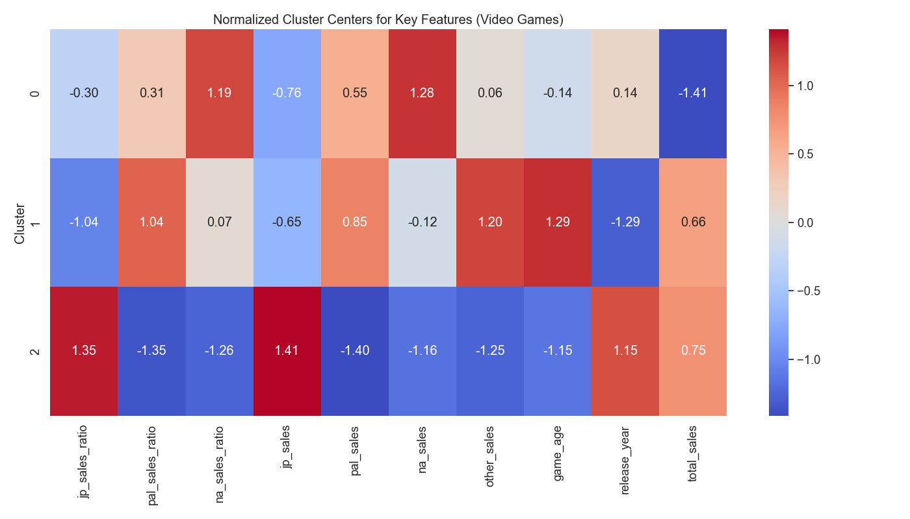
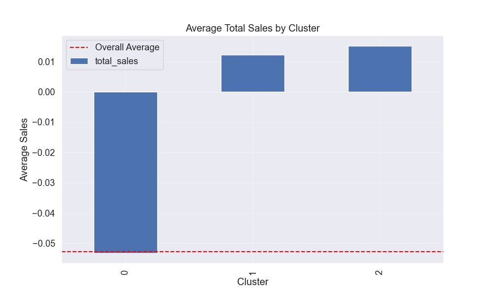

# Video Game Sales Clustering Analysis

## Introduction

This report presents the results of a clustering analysis performed on the VGChartz video game sales dataset. The goal was to identify natural groupings of video games based on their sales patterns, critic scores, and other relevant characteristics. K-means clustering was applied to identify meaningful segments in the gaming market, which could provide insights for game developers, publishers, and marketers.

## Methodology

### Data Preparation

The analysis was performed on the processed VGChartz dataset containing 4,000 video game records after cleaning. The preprocessing steps included:

- Handling missing values
- Removing outliers
- Standardizing numeric features
- Encoding categorical variables
- Engineering new features like regional sales ratios and game age

### Feature Selection

From the available numeric features, we selected 12 key features for clustering:

1. `critic_score`: Rating given by critics (standardized)
2. `total_sales`: Total global sales (standardized)
3. `na_sales`: North American sales (standardized)
4. `jp_sales`: Japan sales (standardized)
5. `pal_sales`: PAL (Europe, Australia) sales (standardized)
6. `other_sales`: Sales in other regions (standardized)
7. `release_year`: Year the game was released
8. `na_sales_ratio`: Proportion of North American sales to total sales
9. `jp_sales_ratio`: Proportion of Japanese sales to total sales
10. `pal_sales_ratio`: Proportion of PAL sales to total sales
11. `game_age`: Number of years since the game's release
12. `sales_per_year`: Average sales per year since release

### Determining Optimal Clusters

To determine the optimal number of clusters, we used both the Elbow Method and Silhouette Score analysis. The Silhouette Score measures how similar an object is to its own cluster compared to other clusters, with higher scores indicating better defined clusters.

Based on the silhouette score analysis, **3 clusters** were identified as optimal with a silhouette score of 0.902, indicating well-separated clusters.

## Clustering Results

### Cluster Distribution

The K-means algorithm identified three distinct clusters with the following distribution:

- **Cluster 0**: 3,970 games (99.25% of the dataset)
- **Cluster 1**: 26 games (0.65% of the dataset)
- **Cluster 2**: 4 games (0.10% of the dataset)

This highly imbalanced distribution suggests that while most games follow similar sales patterns (Cluster 0), there are a few games with distinctive characteristics that form separate clusters (Clusters 1 and 2).

### Cluster Visualization

Using Principal Component Analysis (PCA), we reduced the dimensionality of the data to visualize the clusters in a two-dimensional space:

The visualization confirms the presence of three distinct clusters, with Clusters 1 and 2 being small but clearly separated from the majority cluster.

### Key Characteristics of Each Cluster

A heatmap of normalized feature values across clusters reveals the distinctive characteristics of each group:

#### Cluster 0: "Globally Balanced Games" (99.25%)
- Slightly lower total sales compared to other clusters
- Balanced distribution across regions, with a slight preference for North American market
- Represents the "typical" sales pattern for most video games
- Examples: The Legend of Heroes: Trails of Cold Steel II, The Walking Dead: A Telltale Games Series

#### Cluster 1: "PAL Region Specialists" (0.65%)
- Slightly above average total sales
- Significantly higher sales and sales ratios in PAL regions (Europe, Australia)
- Lower sales in Japan
- Older games (higher game age)
- Examples: Birds of Steel, Harvest Moon: The Land of Origin, Dora the Explorer: Journey to the Purple Planet

#### Cluster 2: "Japan-Focused Games" (0.10%)
- Highest total sales among all clusters
- Dramatically higher sales and sales ratios in Japan
- Significantly lower sales in PAL regions and North America
- Examples: Persona 5, 7th Dragon III Code: VFD, Toukiden: The Age of Demons, Atelier Meruru: Alchemist of Arland 3

### Regional Sales Analysis

The regional sales patterns across clusters are particularly insightful:

This visualization reinforces the regional specialization of Clusters 1 and 2, while Cluster 0 shows a more balanced regional distribution.

### Sales Performance by Cluster

Despite their small size, Clusters 1 and 2 contain games with higher average sales figures:

This suggests that regional specialization can be a viable strategy for achieving higher sales in the gaming market.

## Insights and Business Implications

1. **Market Segmentation Strategy**: The vast majority of games (Cluster 0) follow a similar sales pattern with balanced regional distribution. However, the existence of successful regional specialists (Clusters 1 and 2) suggests that targeted regional approaches can be effective.

2. **Japan-Focused Games**: The extremely small but distinctive Cluster 2 represents highly successful games that perform exceptionally well in Japan but underperform in other regions. These games tend to be JRPGs and other genres with strong appeal to Japanese audiences (e.g., Persona 5).

3. **PAL Region Specialists**: Cluster 1 represents games that perform particularly well in European and Australian markets. These tend to be slightly older titles with sustained appeal in these regions.

4. **Critic Scores and Sales**: Interestingly, the standardized critic scores were not significantly different between clusters, suggesting that regional sales patterns may be more influenced by genre, cultural preferences, and marketing strategies than by critical reception.

## Conclusion

The clustering analysis revealed three distinct patterns in video game sales data, primarily differentiated by regional distribution rather than total sales volume or critic scores. While most games follow a globally balanced sales pattern, there exist small but significant groups of games that achieve notable success by focusing on specific regional markets, particularly Japan or the PAL regions.

For publishers and developers, these findings highlight the importance of understanding regional preferences and potentially tailoring game development and marketing strategies to target specific regional audiences when appropriate.

## Future Work

To enhance this analysis, future work could:

1. Incorporate genre information to better understand the relationship between game types and regional preferences
2. Analyze time trends to determine if regional specialization is becoming more or less common
3. Include additional features such as platform, publisher, and marketing spend to get a more comprehensive view of factors influencing sales patterns
4. Apply alternative clustering algorithms to validate the findings 