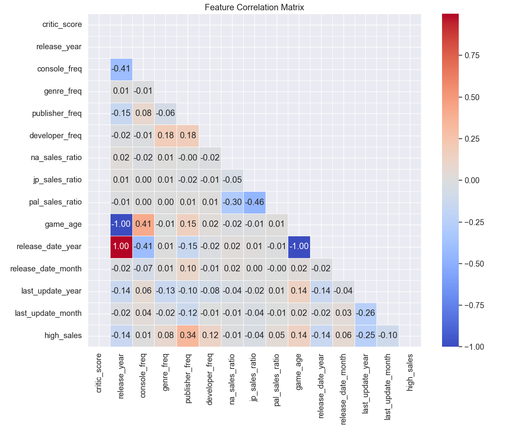

# تحلیل درخت تصمیم برای پیش‌بینی فروش بازی‌های ویدیویی

## مقدمه

این گزارش نتایج تحلیل درخت تصمیم را برای پیش‌بینی میزان فروش بازی‌های ویدیویی بر اساس مجموعه داده‌های VGChartz ارائه می‌دهد. ما از درخت تصمیم به عنوان یک الگوریتم یادگیری ماشین نظارت‌شده برای طبقه‌بندی بازی‌ها به دو دسته "فروش بالا" و "فروش پایین" استفاده کردیم. این تحلیل به توسعه‌دهندگان و ناشران بازی کمک می‌کند تا درک بهتری از عوامل مؤثر بر موفقیت تجاری بازی‌ها داشته باشند.

## روش‌شناسی

### آماده‌سازی داده‌ها

برای این تحلیل، از مجموعه داده پردازش شده VGChartz استفاده کردیم که شامل 4,000 بازی ویدیویی است. مراحل آماده‌سازی داده‌ها شامل موارد زیر بود:

1. **تبدیل ستون‌های تاریخ**: ستون‌های تاریخ مانند `release_date` و `last_update` به ویژگی‌های عددی سال و ماه تبدیل شدند.

2. **ایجاد متغیر هدف**: با استفاده از میانه فروش کل (0.54-) به عنوان آستانه، بازی‌ها را به دو دسته "فروش بالا" (48.25% داده‌ها) و "فروش پایین" (51.75% داده‌ها) طبقه‌بندی کردیم.

3. **انتخاب ویژگی**: برای جلوگیری از نشت داده، ستون‌های مستقیماً مرتبط با فروش کل مانند `na_sales` ،`jp_sales` ،`pal_sales` ،`other_sales` و `sales_per_year` را حذف کردیم. همچنین ستون‌های غیرعددی نیز حذف شدند.

4. **تقسیم داده‌ها**: 75% داده‌ها برای آموزش و 25% برای آزمایش استفاده شد.

5. **استانداردسازی ویژگی‌ها**: همه ویژگی‌ها با استفاده از `StandardScaler` استاندارد شدند.

### ویژگی‌های انتخاب شده

در نهایت، 14 ویژگی زیر برای طبقه‌بندی انتخاب شدند:

1. `critic_score`: امتیاز منتقدان
2. `release_year`: سال انتشار
3. `console_freq`: فراوانی کنسول
4. `genre_freq`: فراوانی ژانر
5. `publisher_freq`: فراوانی ناشر
6. `developer_freq`: فراوانی توسعه‌دهنده
7. `na_sales_ratio`: نسبت فروش آمریکای شمالی
8. `jp_sales_ratio`: نسبت فروش ژاپن
9. `pal_sales_ratio`: نسبت فروش اروپا/استرالیا
10. `game_age`: سن بازی
11. `release_date_year`: سال انتشار (از ستون تاریخ)
12. `release_date_month`: ماه انتشار (از ستون تاریخ)
13. `last_update_year`: سال آخرین به‌روزرسانی
14. `last_update_month`: ماه آخرین به‌روزرسانی

## نتایج تحلیل درخت تصمیم

### عملکرد مدل

مدل درخت تصمیم اولیه با پارامترهای پیش‌فرض و سپس یک مدل بهینه‌سازی شده با استفاده از جستجوی شبکه‌ای آموزش داده شد. نتایج به شرح زیر است:

**مدل اولیه (با پارامترهای پیش‌فرض)**
- دقت: 98.00%
- حساسیت (Recall) کلاس فروش پایین: 98%
- حساسیت (Recall) کلاس فروش بالا: 98%
- امتیاز F1 کلی: 98%

**مدل بهینه‌سازی شده**
- پارامترهای بهینه: `{'criterion': 'gini', 'max_depth': 10, 'min_samples_leaf': 1, 'min_samples_split': 2}`
- دقت: 98.00%
- حساسیت (Recall) کلاس فروش پایین: 98%
- حساسیت (Recall) کلاس فروش بالا: 98%
- امتیاز F1 کلی: 98%

### ماتریس درهم‌ریختگی (Confusion Matrix)

ماتریس درهم‌ریختگی نشان می‌دهد که مدل در طبقه‌بندی هر دو کلاس "فروش پایین" و "فروش بالا" عملکرد بسیار خوبی دارد، با تعداد کمی از موارد نادرست طبقه‌بندی شده.

### اهمیت ویژگی‌ها

تحلیل اهمیت ویژگی‌ها بینش‌های ارزشمندی در مورد عوامل کلیدی موثر بر فروش بازی‌ها فراهم می‌کند:

**سه ویژگی مهم برتر:**
1. `pal_sales_ratio` (نسبت فروش منطقه PAL/اروپا-استرالیا): 61.72%
2. `jp_sales_ratio` (نسبت فروش ژاپن): 24.98%
3. `na_sales_ratio` (نسبت فروش آمریکای شمالی): 10.95%

این نتایج نشان می‌دهد که نسبت‌های فروش منطقه‌ای، به ویژه نسبت فروش در منطقه PAL (اروپا و استرالیا)، قوی‌ترین پیش‌بینی‌کننده‌های طبقه فروش یک بازی هستند. این تأکید می‌کند که الگوهای توزیع منطقه‌ای فروش، عامل متمایزکننده کلیدی بین بازی‌های با فروش بالا و پایین است.

### ساختار درخت تصمیم

درخت تصمیم با حداکثر عمق 3 برای تجسم بهتر:

تجسم درخت تصمیم نشان می‌دهد که چگونه الگوریتم از نسبت‌های فروش منطقه‌ای برای طبقه‌بندی بازی‌ها استفاده می‌کند. گره‌های بالایی درخت مبتنی بر معیارهای `pal_sales_ratio` و `jp_sales_ratio` هستند، که اهمیت این ویژگی‌ها را برای طبقه‌بندی تأیید می‌کند.

### توزیع نسبت‌های فروش منطقه‌ای بر اساس کلاس فروش

این نمودار نشان می‌دهد که چگونه نسبت‌های فروش منطقه‌ای بین کلاس‌های فروش بالا و پایین متفاوت است. به طور خاص:
- بازی‌های با فروش بالا معمولاً نسبت‌های فروش متفاوتی در مناطق مختلف در مقایسه با بازی‌های با فروش پایین دارند.
- این تفاوت‌ها تأیید می‌کند که استراتژی‌های توزیع منطقه‌ای می‌تواند نقش مهمی در موفقیت کلی یک بازی داشته باشد.

### همبستگی بین ویژگی‌ها

ماتریس همبستگی روابط بین ویژگی‌های مختلف را نشان می‌دهد:
- همبستگی منفی قابل توجهی بین نسبت‌های فروش منطقه‌ای مختلف وجود دارد، که منطقی است زیرا افزایش نسبت فروش در یک منطقه به طور طبیعی باعث کاهش نسبت در سایر مناطق می‌شود.
- سن بازی با سال انتشار همبستگی منفی قوی دارد، که قابل انتظار است.
- همبستگی‌های جالبی بین فراوانی ناشر/توسعه‌دهنده و نسبت‌های فروش منطقه‌ای وجود دارد، که نشان می‌دهد ناشران و توسعه‌دهندگان خاص ممکن است در بازارهای منطقه‌ای خاص بهتر عمل کنند.

## بینش‌های کلیدی و کاربردهای تجاری

1. **اهمیت استراتژی منطقه‌ای**: نسبت‌های فروش منطقه‌ای مهم‌ترین ویژگی‌ها برای پیش‌بینی موفقیت بازی هستند. ناشران باید استراتژی‌های توزیع منطقه‌ای خود را بر اساس نوع بازی و بازار هدف بهینه کنند.

2. **بازار اروپا/استرالیا (PAL)**: نسبت فروش PAL مهم‌ترین ویژگی در مدل است، که نشان می‌دهد این منطقه می‌تواند نقش کلیدی در تعیین موفقیت کلی بازی داشته باشد. توجه ویژه به ترجیحات بازار اروپا می‌تواند ارزشمند باشد.

3. **ناشران و توسعه‌دهندگان**: فراوانی ناشر و توسعه‌دهنده در تصمیمات درخت تصمیم نقش دارند، که نشان می‌دهد شهرت و تجربه در صنعت می‌تواند بر فروش تأثیر بگذارد.

4. **زمان‌بندی انتشار**: سال و ماه انتشار تأثیرات کوچکی بر طبقه‌بندی فروش دارند. این می‌تواند نشان‌دهنده الگوهای فصلی یا تغییرات سالانه در رفتار خرید مصرف‌کنندگان باشد.

5. **امتیاز منتقدان**: به طور جالبی، امتیاز منتقدان اهمیت نسبتاً کمی در مدل دارد. این نشان می‌دهد که اگرچه امتیازات خوب منتقدان می‌تواند مفید باشد، اما لزوماً پیش‌بینی‌کننده قوی برای فروش بالا نیست.

## نتیجه‌گیری

مدل درخت تصمیم با دقت 98% موفق به طبقه‌بندی بازی‌های ویدیویی به دسته‌های "فروش بالا" و "فروش پایین" شد. این دقت بالا نشان می‌دهد که الگوهای قابل شناسایی قوی در داده‌ها وجود دارد که می‌تواند برای پیش‌بینی موفقیت تجاری بازی‌ها استفاده شود.

نتایج نشان می‌دهد که الگوی توزیع فروش منطقه‌ای، به ویژه نسبت فروش در منطقه اروپا/استرالیا (PAL)، مهم‌ترین عامل متمایزکننده بین بازی‌های موفق و کمتر موفق است. این یافته‌ها می‌تواند به ناشران و توسعه‌دهندگان بازی‌های ویدیویی در بهینه‌سازی استراتژی‌های بازاریابی، توزیع و توسعه محصول خود کمک کند.

## کاربردهای عملی

1. **پیش‌بینی فروش پیش از انتشار**: توسعه‌دهندگان می‌توانند از مدل مشابهی برای پیش‌بینی احتمال موفقیت بازی‌های در حال توسعه استفاده کنند.

2. **تصمیم‌گیری استراتژیک**: شرکت‌های بازی می‌توانند از این بینش‌ها برای هدایت تصمیمات مربوط به انتشار منطقه‌ای، بودجه بازاریابی و تمرکز توسعه استفاده کنند.

3. **بهینه‌سازی پورتفولیو**: ناشران بزرگ می‌توانند از این تحلیل‌ها برای متوازن‌سازی پورتفولیوی محصولات خود استفاده کنند، با اطمینان از داشتن ترکیب مناسبی از بازی‌ها که در مناطق مختلف عملکرد خوبی دارند.

4. **تحلیل بازار هدف**: تحلیل نسبت‌های فروش منطقه‌ای می‌تواند به شناسایی بازارهای هدف مناسب برای انواع خاصی از بازی‌ها کمک کند.

## کارهای آینده

برای بهبود این تحلیل، کارهای آتی می‌تواند شامل موارد زیر باشد:

1. **ترکیب اطلاعات ژانر**: افزودن مجدد اطلاعات ژانر به صورت متغیرهای دسته‌ای کدگذاری شده می‌تواند بینش‌های دقیق‌تری در مورد تأثیر ژانر بر الگوهای فروش ارائه دهد.

2. **تحلیل روند زمانی**: بررسی تغییرات الگوهای فروش در طول زمان می‌تواند بینش‌های ارزشمندی در مورد تغییر ترجیحات بازار ارائه دهد.

3. **مدل‌های پیچیده‌تر**: استفاده از الگوریتم‌های یادگیری ماشین پیشرفته‌تر مانند جنگل تصادفی یا گرادیان تقویت شده می‌تواند عملکرد پیش‌بینی را بهبود بخشد.

4. **پیش‌بینی مقدار دقیق فروش**: به جای طبقه‌بندی دودویی، توسعه مدل‌هایی برای پیش‌بینی مقدار دقیق فروش می‌تواند ارزشمند باشد.

5. **تحلیل احساسات نظرات کاربران**: ترکیب داده‌های متنی از نظرات کاربران و مرورها می‌تواند بعد جدیدی به تحلیل اضافه کند. 