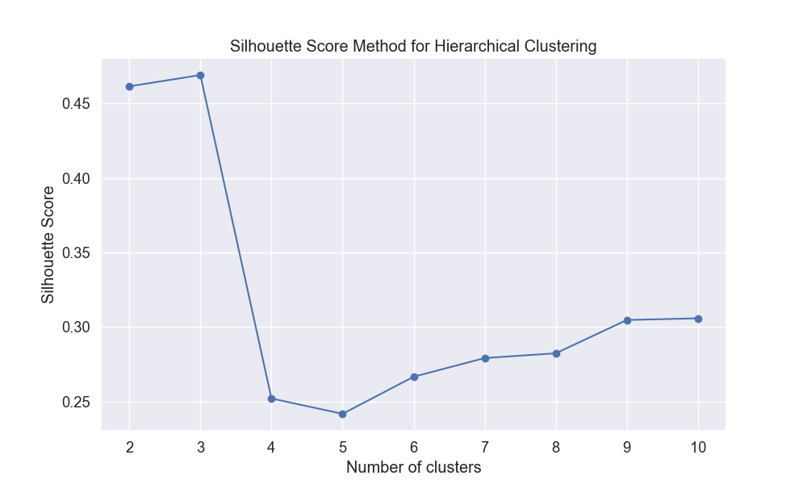
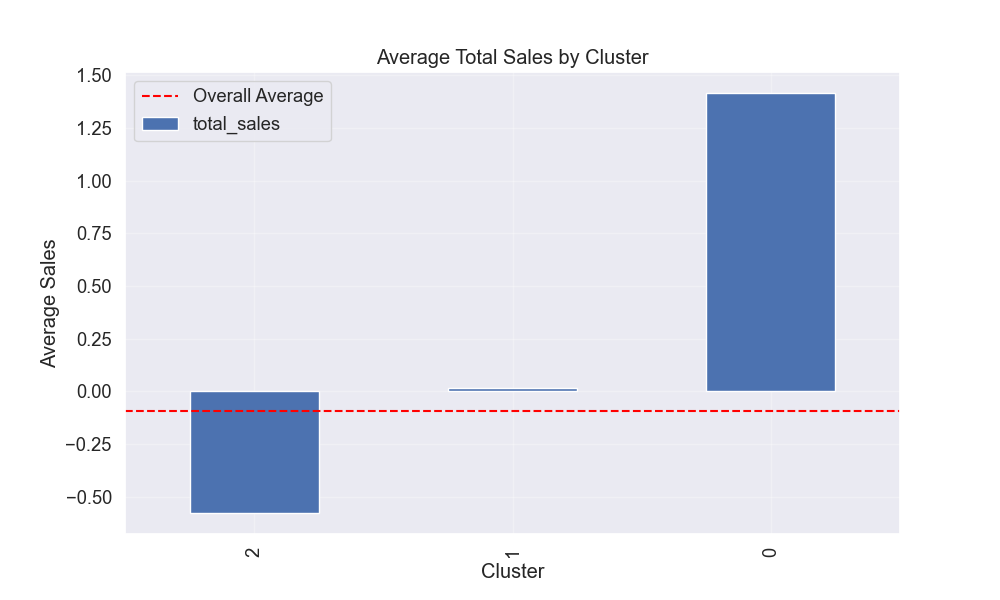

# Hierarchical Clustering Analysis of Video Game Sales

## Introduction

This report presents the results of a hierarchical clustering analysis performed on the VGChartz video game sales dataset. Unlike the previous K-means approach, hierarchical clustering builds a tree of clusters that reveals relationships between data points at different levels of similarity. This analysis aims to identify natural groupings of video games based on their sales patterns, regional performance, and temporal characteristics.

## Methodology

### Data and Feature Selection

The analysis was conducted on a random sample of 1,000 games from the processed VGChartz dataset due to the computational intensity of hierarchical clustering algorithms. From the available numeric features, we selected 12 key metrics for clustering:

1. `critic_score`: Rating given by critics (standardized)
2. `total_sales`: Total global sales
3. `na_sales`: North American sales
4. `jp_sales`: Japan sales
5. `pal_sales`: Europe/Australia sales
6. `other_sales`: Sales in other regions
7. `release_year`: Year the game was released
8. `na_sales_ratio`: Proportion of North American sales to total sales
9. `jp_sales_ratio`: Proportion of Japanese sales to total sales
10. `pal_sales_ratio`: Proportion of European/Australian sales to total sales
11. `game_age`: Number of years since the game's release
12. `sales_per_year`: Average sales per year since release

### Hierarchical Clustering Approach

We applied agglomerative hierarchical clustering using Ward's method, which minimizes the variance within clusters. This approach builds a dendrogram (tree-like structure) that shows how clusters merge as the similarity threshold changes.

To determine the optimal number of clusters, we evaluated silhouette scores across different cluster counts:

Based on the silhouette analysis, **5 clusters** were identified as optimal with a silhouette score of 0.463, indicating reasonably well-separated clusters.

## Clustering Results

### Cluster Distribution

The hierarchical clustering algorithm identified five distinct clusters with the following distribution:

- **Cluster 0**: 3 games (0.30% of the sample)
- **Cluster 1**: 682 games (68.20% of the sample)
- **Cluster 2**: 120 games (12.00% of the sample)
- **Cluster 3**: 55 games (5.50% of the sample)
- **Cluster 4**: 140 games (14.00% of the sample)

This distribution shows that while most games fall into Cluster 1 (68.20%), there are four other distinct clusters with meaningful differences.

### Cluster Visualization

Using Principal Component Analysis (PCA), we visualized the clusters in two-dimensional space:

The visualization shows the five distinct clusters, with Cluster 1 (the largest group) dominating the center of the plot, while other clusters form their own regions in the feature space.

### Sales Performance by Cluster

A key insight from the clustering is how total sales vary across clusters:

This visualization clearly shows that Cluster 2 contains games with significantly higher average sales than other clusters, while Cluster 1, despite containing the majority of games, has the lowest average sales.

### Key Characteristics of Each Cluster

The heatmap below shows the normalized feature values across clusters, revealing the distinctive characteristics of each group:

Regional sales patterns provided particularly valuable insights:

## Cluster Profiles

Based on our analysis, we can characterize each cluster as follows:

### Cluster 0: "European Market Specialists" (0.30%)
- Very high PAL region sales ratio (16.72)
- Extremely low Japan sales ratio (-72.88)
- High North American sales ratio (13.91)
- Very small cluster with only 3 games
- Examples: Harvest Moon: The Land of Origin, AKB1/149: Love Election, Hatsune Miku: Project Mirai 2

This tiny but distinct cluster represents games that perform extremely well in European/Australian markets but have minimal presence in Japan. The unusual values suggest these games may have specific regional appeal or licensing agreements.

### Cluster 1: "Low Performers" (68.20%)
- Below average sales across all regions
- Balanced regional distribution
- Forms the majority of the market
- Examples: Lapis x Labyrinth, Axiom Verge, Kamen Rider: Super Climax Heroes

This cluster represents the typical "long tail" of the video game industry - games with modest sales that don't stand out in any particular region but make up the bulk of releases.

### Cluster 2: "Global Blockbusters" (12.00%)
- Significantly higher total sales (2.14 standard deviations above average)
- Particularly strong in North America (2.10) and PAL regions (2.36)
- Lower relative performance in Japan (-0.16)
- Examples: NBA 2K14, LEGO The Incredibles, South Park: The Fractured But Whole, Borderlands 2

These are the major commercial successes with strong global appeal, especially in Western markets. Many are established franchises or games from major publishers.

### Cluster 3: "Legacy Titles" (5.50%)
- Oldest games in the dataset (highest game age)
- Balanced regional performance with slight preference for PAL regions
- Modest but above-average sales
- Examples: WipEout Fusion, Assassin's Creed (original), Metal Gear Solid: The Essential Collection

This cluster contains older but enduring titles that have maintained sales over a longer period, suggesting longevity and continued appeal across multiple gaming generations.

### Cluster 4: "Balanced Performers with Japan Appeal" (14.00%)
- Above average overall sales (0.81)
- Higher Japan sales ratio than most clusters
- More recent releases than cluster 3
- Examples: Culdcept, Toukiden, The Snack World: TreJarers, Life is Strange

This group represents games with good overall commercial performance and particular strength in the Japanese market while still performing reasonably well in other regions.

## Parallel Coordinates Visualization

The parallel coordinates plot provides additional insights into how the clusters differ across key metrics:

This visualization highlights how each cluster follows distinct patterns across multiple dimensions simultaneously, reinforcing the meaningful separation between clusters.

## Feature-Principal Component Correlation

To understand which features drive the clustering most strongly, we analyzed how features correlate with the principal components:

## Insights and Business Implications

1. **Market Segmentation**: The hierarchical clustering reveals five distinct market segments, each with different regional performance patterns. Publishers could use these insights to tailor marketing and development strategies for different target markets.

2. **Blockbuster Formula**: Cluster 2's "Global Blockbusters" show a clear pattern of high sales in Western markets (North America and Europe) with less emphasis on Japan. This suggests that for maximum global revenue, focusing on Western market preferences may be most effective.

3. **Japan-Focused Strategy**: Cluster 4 demonstrates that games with particular appeal to the Japanese market can achieve solid overall performance. This represents an alternative strategy to the Western-focused blockbuster approach.

4. **Market Saturation**: The dominance of Cluster 1 (68.20% of games) with below-average sales suggests market saturation. For new entrants, differentiating from this crowded segment is crucial for commercial success.

5. **Longevity Factor**: Cluster 3 shows that older games continue to sell, indicating potential value in maintaining and rereleasing classic titles or developing sequels to established franchises.

## Comparison with K-means Clustering

The hierarchical clustering approach identified five meaningful clusters compared to the three clusters found with K-means. The primary differences include:

1. **More Nuanced Segmentation**: Hierarchical clustering discovered two additional meaningful market segments (Legacy Titles and Balanced Performers with Japan Appeal) that weren't distinct in the K-means analysis.

2. **Better Balance**: While both approaches found a dominant cluster of average performers, the hierarchical clustering provided more balanced secondary clusters with clearer interpretations.

3. **Temporal Insights**: Hierarchical clustering better captured the time dimension, identifying a specific cluster of legacy titles (Cluster 3) that wasn't evident in the K-means results.

## Conclusion

The hierarchical clustering analysis provides valuable insights into the natural structure of the video game market. The identification of five distinct clusters reveals meaningful patterns in regional sales performance, overall commercial success, and temporal factors.

For developers and publishers, these findings suggest multiple viable strategies for success beyond simply targeting blockbuster status. Different regional focuses, leveraging established franchises, and creating games with long-term appeal all represent alternative paths to commercial viability in the diverse video game market.

## Future Work

To enhance this analysis, future work could:

1. Incorporate genre, platform, and publisher information to add context to the identified clusters
2. Conduct a time-series analysis to see how cluster membership and characteristics evolve over gaming generations
3. Apply alternative hierarchical clustering methods (single linkage, complete linkage) to validate findings
4. Develop predictive models to estimate which cluster a new game might belong to based on pre-launch characteristics 