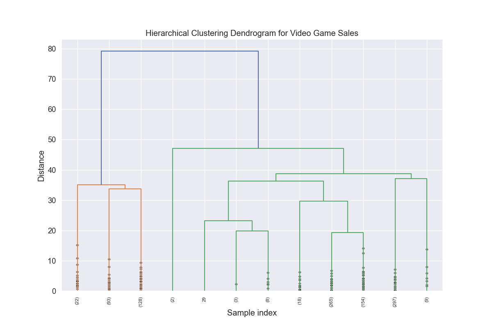

# تحلیل خوشه‌بندی سلسله‌مراتبی فروش بازی‌های ویدیویی

## مقدمه

این گزارش نتایج تحلیل خوشه‌بندی سلسله‌مراتبی انجام شده بر روی مجموعه داده فروش بازی‌های ویدیویی VGChartz را ارائه می‌دهد. برخلاف روش قبلی K-means، خوشه‌بندی سلسله‌مراتبی یک درخت از خوشه‌ها ایجاد می‌کند که روابط بین نقاط داده را در سطوح مختلف شباهت نشان می‌دهد. این تحلیل هدف شناسایی گروه‌بندی‌های طبیعی بازی‌های ویدیویی بر اساس الگوهای فروش، عملکرد منطقه‌ای و ویژگی‌های زمانی را دارد.

## روش‌شناسی

### انتخاب داده و ویژگی

این تحلیل بر روی یک نمونه تصادفی از 1,000 بازی از مجموعه داده پردازش شده VGChartz به دلیل شدت محاسباتی الگوریتم‌های خوشه‌بندی سلسله‌مراتبی انجام شد. از ویژگی‌های عددی موجود، 12 معیار کلیدی زیر برای خوشه‌بندی انتخاب شدند:

1. `critic_score`: امتیاز داده شده توسط منتقدان (استاندارد شده)
2. `total_sales`: فروش کل جهانی
3. `na_sales`: فروش آمریکای شمالی
4. `jp_sales`: فروش ژاپن
5. `pal_sales`: فروش اروپا/استرالیا
6. `other_sales`: فروش در سایر مناطق
7. `release_year`: سال انتشار بازی
8. `na_sales_ratio`: نسبت فروش آمریکای شمالی به فروش کل
9. `jp_sales_ratio`: نسبت فروش ژاپن به فروش کل
10. `pal_sales_ratio`: نسبت فروش اروپا/استرالیا به فروش کل
11. `game_age`: تعداد سال‌های گذشته از زمان انتشار بازی
12. `sales_per_year`: میانگین فروش سالانه از زمان انتشار

### رویکرد خوشه‌بندی سلسله‌مراتبی

ما خوشه‌بندی سلسله‌مراتبی تجمعی با استفاده از روش وارد (Ward) را اعمال کردیم که واریانس درون خوشه‌ها را به حداقل می‌رساند. این رویکرد یک دندروگرام (ساختار درخت‌مانند) ایجاد می‌کند که نشان می‌دهد خوشه‌ها چگونه با تغییر آستانه شباهت ادغام می‌شوند.

برای تعیین تعداد بهینه خوشه‌ها، نمرات سیلوئت را در تعداد خوشه‌های مختلف ارزیابی کردیم:

بر اساس تحلیل سیلوئت، **5 خوشه** به‌عنوان تعداد بهینه با نمره سیلوئت 0.463 شناسایی شدند که نشان‌دهنده خوشه‌های نسبتاً خوب تفکیک‌شده است.

## نتایج خوشه‌بندی

### توزیع خوشه‌ها

الگوریتم خوشه‌بندی سلسله‌مراتبی پنج خوشه متمایز با توزیع زیر شناسایی کرد:

- **خوشه 0**: 3 بازی (0.30% از نمونه)
- **خوشه 1**: 682 بازی (68.20% از نمونه)
- **خوشه 2**: 120 بازی (12.00% از نمونه)
- **خوشه 3**: 55 بازی (5.50% از نمونه)
- **خوشه 4**: 140 بازی (14.00% از نمونه)

این توزیع نشان می‌دهد که اگرچه اکثر بازی‌ها در خوشه 1 (68.20%) قرار می‌گیرند، چهار خوشه متمایز دیگر با تفاوت‌های معنادار وجود دارد.

### تصویرسازی خوشه‌ها

با استفاده از تحلیل مؤلفه‌های اصلی (PCA)، خوشه‌ها را در فضای دوبعدی تصویرسازی کردیم:

این تصویرسازی پنج خوشه متمایز را نشان می‌دهد، با خوشه 1 (بزرگترین گروه) که مرکز نمودار را در اختیار دارد، در حالی که خوشه‌های دیگر مناطق خاص خود را در فضای ویژگی تشکیل می‌دهند.

### عملکرد فروش بر اساس خوشه

یکی از بینش‌های کلیدی از خوشه‌بندی، چگونگی تغییر فروش کل در خوشه‌های مختلف است:

این تصویرسازی به وضوح نشان می‌دهد که خوشه 2 شامل بازی‌هایی با میانگین فروش به طور قابل توجهی بالاتر از سایر خوشه‌ها است، در حالی که خوشه 1، با وجود داشتن اکثریت بازی‌ها، کمترین میانگین فروش را دارد.

### ویژگی‌های کلیدی هر خوشه

نقشه حرارتی زیر مقادیر ویژگی نرمال‌سازی شده در خوشه‌ها را نشان می‌دهد و ویژگی‌های متمایز هر گروه را آشکار می‌کند:

الگوهای فروش منطقه‌ای بینش‌های به ویژه ارزشمندی را ارائه داد:

## پروفایل خوشه‌ها

بر اساس تحلیل ما، هر خوشه را می‌توان به صورت زیر مشخص کرد:

### خوشه 0: «متخصصان بازار اروپا» (0.30%)
- نسبت فروش بسیار بالا در منطقه PAL (16.72)
- نسبت فروش بسیار پایین در ژاپن (-72.88)
- نسبت فروش بالا در آمریکای شمالی (13.91)
- خوشه بسیار کوچک با تنها 3 بازی
- مثال‌ها: Harvest Moon: The Land of Origin, AKB1/149: Love Election, Hatsune Miku: Project Mirai 2

این خوشه کوچک اما متمایز نشان‌دهنده بازی‌هایی است که در بازارهای اروپایی/استرالیایی به طور فوق‌العاده‌ای خوب عمل می‌کنند اما حضور بسیار کمی در ژاپن دارند. مقادیر غیرعادی نشان می‌دهد که این بازی‌ها ممکن است جذابیت منطقه‌ای خاص یا قراردادهای مجوز ویژه داشته باشند.

### خوشه 1: «عملکرد ضعیف» (68.20%)
- فروش زیر متوسط در تمام مناطق
- توزیع منطقه‌ای متعادل
- اکثریت بازار را تشکیل می‌دهد
- مثال‌ها: Lapis x Labyrinth, Axiom Verge, Kamen Rider: Super Climax Heroes

این خوشه نشان‌دهنده «دم بلند» معمول صنعت بازی‌های ویدیویی است - بازی‌هایی با فروش متوسط که در هیچ منطقه خاصی برجسته نیستند اما بخش عمده‌ای از انتشارات را تشکیل می‌دهند.

### خوشه 2: «بلاک‌باسترهای جهانی» (12.00%)
- فروش کل به طور قابل توجهی بالاتر (2.14 انحراف معیار بالاتر از میانگین)
- به ویژه قوی در آمریکای شمالی (2.10) و مناطق PAL (2.36)
- عملکرد نسبی پایین‌تر در ژاپن (-0.16)
- مثال‌ها: NBA 2K14, LEGO The Incredibles, South Park: The Fractured But Whole, Borderlands 2

اینها موفقیت‌های تجاری بزرگ با جذابیت جهانی قوی هستند، به ویژه در بازارهای غربی. بسیاری از آنها فرنچایزهای شناخته شده یا بازی‌هایی از ناشران بزرگ هستند.

### خوشه 3: «عناوین ماندگار» (5.50%)
- قدیمی‌ترین بازی‌ها در مجموعه داده (بالاترین سن بازی)
- عملکرد منطقه‌ای متعادل با ترجیح اندک برای مناطق PAL
- فروش متوسط اما بالاتر از میانگین
- مثال‌ها: WipEout Fusion, Assassin's Creed (اصلی), Metal Gear Solid: The Essential Collection

این خوشه شامل عناوین قدیمی اما ماندگار است که فروش خود را در طول دوره طولانی‌تری حفظ کرده‌اند، که نشان‌دهنده عمر طولانی و جذابیت مستمر در چندین نسل بازی است.

### خوشه 4: «عملکرد متعادل با جاذبه ژاپنی» (14.00%)
- فروش کل بالاتر از میانگین (0.81)
- نسبت فروش ژاپن بالاتر از اکثر خوشه‌ها
- انتشار جدیدتر نسبت به خوشه 3
- مثال‌ها: Culdcept, Toukiden, The Snack World: TreJarers, Life is Strange

این گروه نشان‌دهنده بازی‌هایی با عملکرد تجاری خوب کلی و قدرت خاص در بازار ژاپن است در حالی که همچنان در سایر مناطق عملکرد نسبتاً خوبی دارند.

## تصویرسازی مختصات موازی

نمودار مختصات موازی بینش‌های اضافی در مورد چگونگی تفاوت خوشه‌ها در معیارهای کلیدی ارائه می‌دهد:

این تصویرسازی نشان می‌دهد که چگونه هر خوشه از الگوهای متمایز در چندین بعد به طور همزمان پیروی می‌کند، که جدایی معنادار بین خوشه‌ها را تقویت می‌کند.

## همبستگی ویژگی-مؤلفه اصلی

برای درک اینکه کدام ویژگی‌ها خوشه‌بندی را بیشتر هدایت می‌کنند، تحلیل کردیم که ویژگی‌ها چگونه با مؤلفه‌های اصلی همبستگی دارند:

## بینش‌ها و پیامدهای تجاری

1. **بخش‌بندی بازار**: خوشه‌بندی سلسله‌مراتبی پنج بخش بازار متمایز را نشان می‌دهد، هر کدام با الگوهای عملکرد منطقه‌ای متفاوت. ناشران می‌توانند از این بینش‌ها برای تطبیق استراتژی‌های بازاریابی و توسعه برای بازارهای هدف مختلف استفاده کنند.

2. **فرمول بلاک‌باستر**: خوشه 2 «بلاک‌باسترهای جهانی» الگوی واضحی از فروش بالا در بازارهای غربی (آمریکای شمالی و اروپا) با تأکید کمتر بر ژاپن نشان می‌دهد. این نشان می‌دهد که برای حداکثر درآمد جهانی، تمرکز بر ترجیحات بازار غربی ممکن است مؤثرترین باشد.

3. **استراتژی متمرکز بر ژاپن**: خوشه 4 نشان می‌دهد که بازی‌هایی با جذابیت خاص برای بازار ژاپن می‌توانند به عملکرد کلی مناسبی دست یابند. این یک استراتژی جایگزین برای رویکرد بلاک‌باستر متمرکز بر غرب است.

4. **اشباع بازار**: غلبه خوشه 1 (68.20% از بازی‌ها) با فروش زیر میانگین نشان‌دهنده اشباع بازار است. برای تازه‌واردها، متمایز شدن از این بخش شلوغ برای موفقیت تجاری ضروری است.

5. **عامل ماندگاری**: خوشه 3 نشان می‌دهد که بازی‌های قدیمی‌تر همچنان به فروش می‌رسند، که نشان‌دهنده ارزش بالقوه در حفظ و انتشار مجدد عناوین کلاسیک یا توسعه دنباله‌هایی برای فرنچایزهای شناخته شده است.

## مقایسه با خوشه‌بندی K-means

رویکرد خوشه‌بندی سلسله‌مراتبی پنج خوشه معنادار را در مقایسه با سه خوشه یافته شده با K-means شناسایی کرد. تفاوت‌های اصلی عبارتند از:

1. **بخش‌بندی دقیق‌تر**: خوشه‌بندی سلسله‌مراتبی دو بخش بازار معنادار اضافی (عناوین ماندگار و عملکرد متعادل با جاذبه ژاپنی) را کشف کرد که در تحلیل K-means متمایز نبودند.

2. **تعادل بهتر**: در حالی که هر دو رویکرد یک خوشه غالب از عملکردهای متوسط یافتند، خوشه‌بندی سلسله‌مراتبی خوشه‌های ثانویه متعادل‌تری با تفسیرهای واضح‌تر ارائه داد.

3. **بینش‌های زمانی**: خوشه‌بندی سلسله‌مراتبی بعد زمانی را بهتر ثبت کرد و یک خوشه مشخص از عناوین ماندگار (خوشه 3) را شناسایی کرد که در نتایج K-means مشخص نبود.

## نتیجه‌گیری

تحلیل خوشه‌بندی سلسله‌مراتبی بینش‌های ارزشمندی در مورد ساختار طبیعی بازار بازی‌های ویدیویی ارائه می‌دهد. شناسایی پنج خوشه متمایز، الگوهای معناداری در عملکرد فروش منطقه‌ای، موفقیت تجاری کلی و عوامل زمانی را آشکار می‌کند.

برای توسعه‌دهندگان و ناشران، این یافته‌ها چندین استراتژی قابل اجرا برای موفقیت فراتر از صرفاً هدف قرار دادن وضعیت بلاک‌باستر را پیشنهاد می‌کند. تمرکزهای منطقه‌ای مختلف، بهره‌برداری از فرنچایزهای شناخته شده و ایجاد بازی‌هایی با جذابیت طولانی‌مدت، همه مسیرهای جایگزین برای دوام تجاری در بازار متنوع بازی‌های ویدیویی را نشان می‌دهند.

## کارهای آینده

برای بهبود این تحلیل، کارهای آتی می‌تواند شامل موارد زیر باشد:

1. ترکیب اطلاعات ژانر، پلتفرم و ناشر برای افزودن زمینه به خوشه‌های شناسایی‌شده
2. انجام تحلیل سری‌های زمانی برای مشاهده چگونگی تکامل عضویت و ویژگی‌های خوشه در طول نسل‌های بازی
3. اعمال روش‌های خوشه‌بندی سلسله‌مراتبی جایگزین (پیوند تکی، پیوند کامل) برای اعتبارسنجی یافته‌ها
4. توسعه مدل‌های پیش‌بینی‌کننده برای تخمین اینکه یک بازی جدید بر اساس ویژگی‌های پیش از راه‌اندازی، به کدام خوشه ممکن است تعلق داشته باشد 