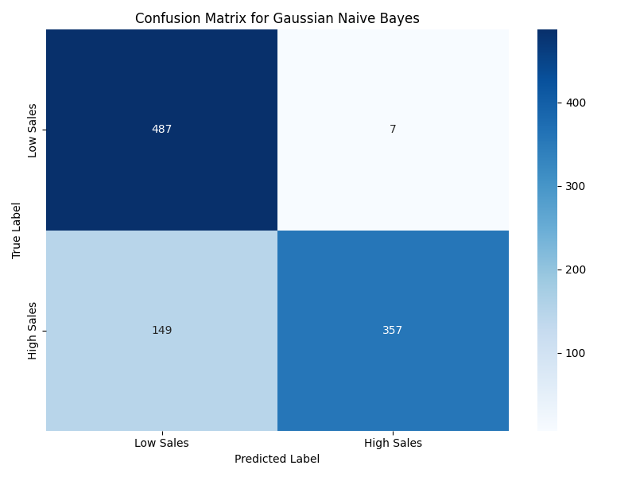
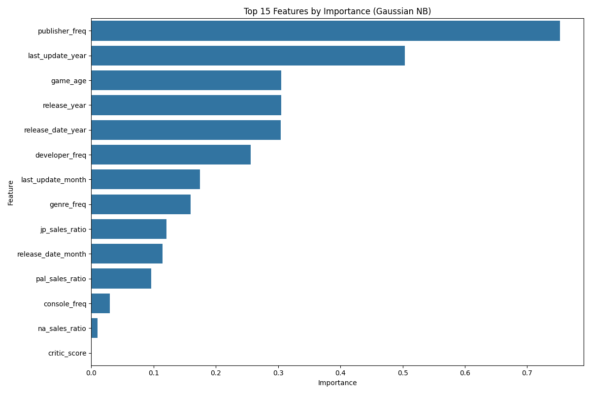
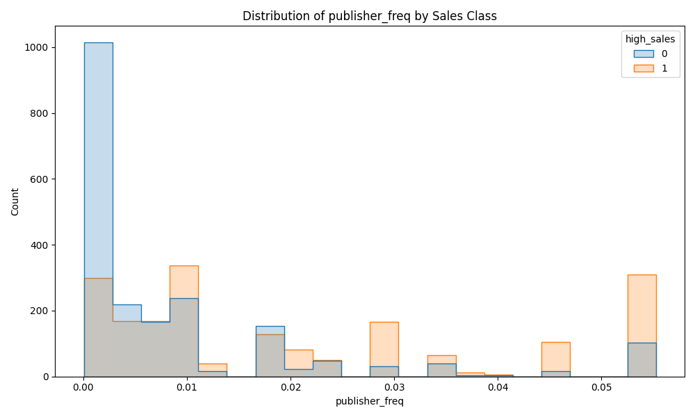

# تحلیل بیز ساده برای پیش‌بینی فروش بازی‌های ویدیویی

## مقدمه

این گزارش نتایج تحلیل بیز ساده (Naive Bayes) را برای پیش‌بینی میزان فروش بازی‌های ویدیویی بر اساس مجموعه داده‌های VGChartz ارائه می‌دهد. ما از دو نوع الگوریتم بیز ساده (گوسی و برنولی) به عنوان الگوریتم‌های یادگیری ماشین نظارت‌شده برای طبقه‌بندی بازی‌ها به دو دسته "فروش بالا" و "فروش پایین" استفاده کردیم. این تحلیل به توسعه‌دهندگان و ناشران بازی کمک می‌کند تا درک بهتری از عوامل مؤثر بر موفقیت تجاری بازی‌ها داشته باشند.

## روش‌شناسی

### آماده‌سازی داده‌ها

برای این تحلیل، از مجموعه داده پردازش شده VGChartz استفاده کردیم که شامل 4,000 بازی ویدیویی است. مراحل آماده‌سازی داده‌ها شامل موارد زیر بود:

1. **تبدیل ستون‌های تاریخ**: ستون‌های تاریخ مانند `release_date` و `last_update` به ویژگی‌های عددی سال و ماه تبدیل شدند.

2. **ایجاد متغیر هدف**: با استفاده از میانه فروش کل (0.54-) به عنوان آستانه، بازی‌ها را به دو دسته "فروش بالا" (48.25% داده‌ها) و "فروش پایین" (51.75% داده‌ها) طبقه‌بندی کردیم.

3. **انتخاب ویژگی**: برای جلوگیری از نشت داده، ستون‌های مستقیماً مرتبط با فروش کل مانند `na_sales` ،`jp_sales` ،`pal_sales` ،`other_sales` و `sales_per_year` را حذف کردیم. همچنین ستون‌های غیرعددی نیز حذف شدند.

4. **تقسیم داده‌ها**: 75% داده‌ها برای آموزش و 25% برای آزمایش استفاده شد.

5. **مقیاس‌بندی ویژگی‌ها**: برخلاف درخت تصمیم، الگوریتم بیز ساده به مقیاس ویژگی‌ها حساس است. بنابراین از `MinMaxScaler` برای مقیاس‌بندی ویژگی‌ها بین 0 و 1 استفاده کردیم، که برای مدل‌های بیز ساده مناسب‌تر از `StandardScaler` است.

### ویژگی‌های انتخاب شده

در نهایت، 14 ویژگی زیر برای طبقه‌بندی انتخاب شدند:

1. `critic_score`: امتیاز منتقدان
2. `release_year`: سال انتشار
3. `console_freq`: فراوانی کنسول
4. `genre_freq`: فراوانی ژانر
5. `publisher_freq`: فراوانی ناشر
6. `developer_freq`: فراوانی توسعه‌دهنده
7. `na_sales_ratio`: نسبت فروش آمریکای شمالی
8. `jp_sales_ratio`: نسبت فروش ژاپن
9. `pal_sales_ratio`: نسبت فروش اروپا/استرالیا
10. `game_age`: سن بازی
11. `release_date_year`: سال انتشار (از ستون تاریخ)
12. `release_date_month`: ماه انتشار (از ستون تاریخ)
13. `last_update_year`: سال آخرین به‌روزرسانی
14. `last_update_month`: ماه آخرین به‌روزرسانی

## نتایج تحلیل بیز ساده

### عملکرد مدل‌ها

دو نوع مدل بیز ساده آموزش داده شدند:

**بیز ساده گوسی (Gaussian Naive Bayes)**
- دقت: 84.40%
- دقت اعتبارسنجی متقابل 5 تایی: 85.50% ± 0.61%
- مساحت زیر منحنی ROC (AUC): 0.966

**بیز ساده برنولی (Bernoulli Naive Bayes)**
- دقت: 55.10%
- دقت اعتبارسنجی متقابل 5 تایی: 55.63% ± 1.96%
- مساحت زیر منحنی ROC (AUC): 0.574

همانطور که نتایج نشان می‌دهد، مدل بیز ساده گوسی عملکرد بسیار بهتری نسبت به مدل برنولی دارد. این نشان می‌دهد که توزیع گوسی برای مدل‌سازی ویژگی‌های عددی در این مجموعه داده مناسب‌تر است.

### ماتریس درهم‌ریختگی (Confusion Matrix)

**ماتریس درهم‌ریختگی برای بیز ساده گوسی**

**ماتریس درهم‌ریختگی برای بیز ساده برنولی**

ماتریس درهم‌ریختگی نشان می‌دهد که مدل بیز ساده گوسی در طبقه‌بندی هر دو کلاس "فروش پایین" و "فروش بالا" عملکرد خوبی دارد، در حالی که مدل برنولی در شناسایی بازی‌های با فروش بالا ضعیف است.

### منحنی ROC

منحنی ROC تأیید می‌کند که مدل بیز ساده گوسی با AUC نزدیک به 0.97 بسیار خوب عمل می‌کند، در حالی که مدل برنولی عملکرد ضعیفی با AUC حدود 0.57 دارد.

### اهمیت ویژگی‌ها

تحلیل اهمیت ویژگی‌ها در بیز ساده گوسی بینش‌های ارزشمندی در مورد عوامل کلیدی موثر بر فروش بازی‌ها فراهم می‌کند:

**پنج ویژگی مهم برتر:**
1. `publisher_freq` (فراوانی ناشر): 0.753
2. `last_update_year` (سال آخرین به‌روزرسانی): 0.503
3. `game_age` (سن بازی): 0.305
4. `release_year` (سال انتشار): 0.305
5. `release_date_year` (سال انتشار از ستون تاریخ): 0.304

این نتایج نشان می‌دهد که برخلاف درخت تصمیم که در آن نسبت‌های فروش منطقه‌ای مهم‌ترین ویژگی‌ها بودند، در مدل بیز ساده گوسی، فراوانی ناشر و مشخصات زمانی بازی (سال به‌روزرسانی و سن بازی) مهم‌ترین عوامل در پیش‌بینی فروش هستند.

### توزیع ویژگی‌های مهم بر اساس کلاس فروش

برای درک بهتر تأثیر ویژگی‌های مهم، توزیع این ویژگی‌ها را بر اساس کلاس فروش بررسی کردیم:

این نمودارها نشان می‌دهند که چگونه توزیع ویژگی‌های مهم بین بازی‌های با فروش بالا و پایین متفاوت است. به عنوان مثال، بازی‌های با فروش بالا معمولاً از ناشران با فراوانی بیشتر (ناشران شناخته شده‌تر) هستند.

### مقایسه با مدل درخت تصمیم

مقایسه عملکرد مدل بیز ساده گوسی با مدل درخت تصمیم قبلی نشان می‌دهد:

| مدل | دقت | دقت اعتبارسنجی متقابل | AUC |
|-----|-----|----------------------|-----|
| درخت تصمیم | 98.00% | غیر قابل دسترس | غیر قابل دسترس |
| بیز ساده گوسی | 84.40% | 85.50% | 0.966 |
| بیز ساده برنولی | 55.10% | 55.63% | 0.574 |

مدل درخت تصمیم دقت بالاتری نسبت به مدل‌های بیز ساده دارد، اما مدل بیز ساده گوسی نیز عملکرد قابل قبولی ارائه می‌دهد و مزیت‌های خاص خود را دارد، از جمله سرعت آموزش بالاتر و قابلیت کار با داده‌های جدید.

## بینش‌های کلیدی و کاربردهای تجاری

1. **اهمیت ناشر**: فراوانی ناشر مهم‌ترین ویژگی در مدل بیز ساده گوسی است، که نشان می‌دهد شهرت و تجربه ناشر نقش مهمی در موفقیت فروش بازی دارد. ناشران شناخته‌شده‌تر احتمال بیشتری برای تولید بازی‌های با فروش بالا دارند.

2. **عوامل زمانی**: ویژگی‌های مرتبط با زمان مانند سال به‌روزرسانی، سن بازی و سال انتشار نقش مهمی در پیش‌بینی فروش بازی دارند. این نشان می‌دهد که زمان‌بندی انتشار و به‌روزرسانی‌ها می‌تواند بر موفقیت بازی تأثیر بگذارد.

3. **تفاوت با درخت تصمیم**: جالب است که بیز ساده و درخت تصمیم ویژگی‌های متفاوتی را به عنوان مهم‌ترین عوامل شناسایی می‌کنند. درخت تصمیم بر نسبت‌های فروش منطقه‌ای تأکید دارد، در حالی که بیز ساده بر ناشر و عوامل زمانی تمرکز می‌کند. این نشان می‌دهد که استفاده از چندین مدل مختلف می‌تواند بینش‌های جامع‌تری ارائه دهد.

4. **روش‌های مختلف مدل‌سازی**: بیز ساده گوسی به طور قابل توجهی بهتر از بیز ساده برنولی عمل می‌کند، که نشان می‌دهد توزیع گوسی برای مدل‌سازی ویژگی‌های عددی در این مجموعه داده مناسب‌تر است.

5. **امتیاز منتقدان**: مشابه با درخت تصمیم، امتیاز منتقدان اهمیت نسبتاً کمی در مدل بیز ساده دارد. این تأیید می‌کند که امتیازات خوب منتقدان لزوماً به فروش بالا منجر نمی‌شود.

## نتیجه‌گیری

مدل بیز ساده گوسی با دقت 84.40% موفق به طبقه‌بندی بازی‌های ویدیویی به دسته‌های "فروش بالا" و "فروش پایین" شد. اگرچه این دقت کمتر از مدل درخت تصمیم (98%) است، اما همچنان عملکرد قابل قبولی دارد و بینش‌های ارزشمند و متفاوتی را ارائه می‌دهد.

نتایج نشان می‌دهد که شهرت و تجربه ناشر (فراوانی ناشر) و عوامل زمانی مانند سال به‌روزرسانی و سن بازی، مهم‌ترین عوامل متمایزکننده بین بازی‌های موفق و کمتر موفق از دیدگاه مدل بیز ساده هستند. این یافته‌ها می‌تواند به ناشران و توسعه‌دهندگان بازی‌های ویدیویی در بهینه‌سازی استراتژی‌های انتشار، زمان‌بندی و به‌روزرسانی بازی‌های خود کمک کند.

## کاربردهای عملی

1. **انتخاب ناشر**: توسعه‌دهندگان می‌توانند با انتخاب ناشران شناخته‌شده و باتجربه، شانس موفقیت بازی خود را افزایش دهند.

2. **زمان‌بندی انتشار و به‌روزرسانی**: برنامه‌ریزی دقیق برای زمان انتشار و به‌روزرسانی‌های بازی می‌تواند تأثیر مثبتی بر فروش داشته باشد.

3. **پیش‌بینی سریع**: مدل بیز ساده گوسی، علیرغم داشتن دقت کمتر نسبت به درخت تصمیم، سریع‌تر آموزش می‌بیند و پیش‌بینی می‌کند، که برای کاربردهای بلادرنگ مفید است.

4. **ترکیب مدل‌ها**: استفاده از نتایج مدل بیز ساده در کنار درخت تصمیم می‌تواند بینش‌های جامع‌تری ارائه دهد و به تصمیم‌گیری بهتر کمک کند.

## کارهای آینده

برای بهبود این تحلیل، کارهای آتی می‌تواند شامل موارد زیر باشد:

1. **بهینه‌سازی بیشتر مدل بیز ساده**: بررسی روش‌های مختلف پیش‌پردازش داده و تنظیم پارامترها برای بهبود عملکرد مدل.

2. **مدل‌های ترکیبی**: استفاده از روش‌های ترکیبی (Ensemble) که نتایج چندین مدل مختلف را ترکیب می‌کنند، می‌تواند عملکرد پیش‌بینی را بهبود بخشد.

3. **افزودن ویژگی‌های جدید**: استخراج ویژگی‌های جدید از داده‌های موجود یا ترکیب با منابع داده‌ای دیگر می‌تواند بینش‌های عمیق‌تری ارائه دهد.

4. **تحلیل روند زمانی**: بررسی دقیق‌تر الگوهای زمانی در فروش بازی‌ها و ارتباط آن با به‌روزرسانی‌ها و رویدادهای صنعت بازی.

5. **مدل‌های احتمالاتی پیشرفته‌تر**: بررسی سایر مدل‌های احتمالاتی که می‌توانند ماهیت پیچیده داده‌های فروش بازی را بهتر مدل‌سازی کنند. 