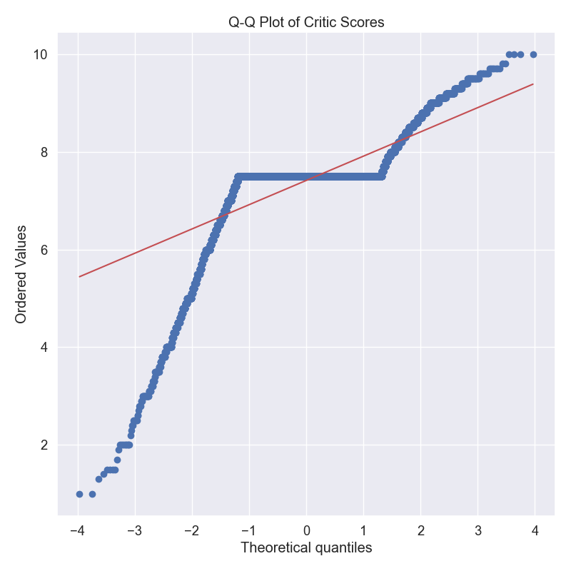
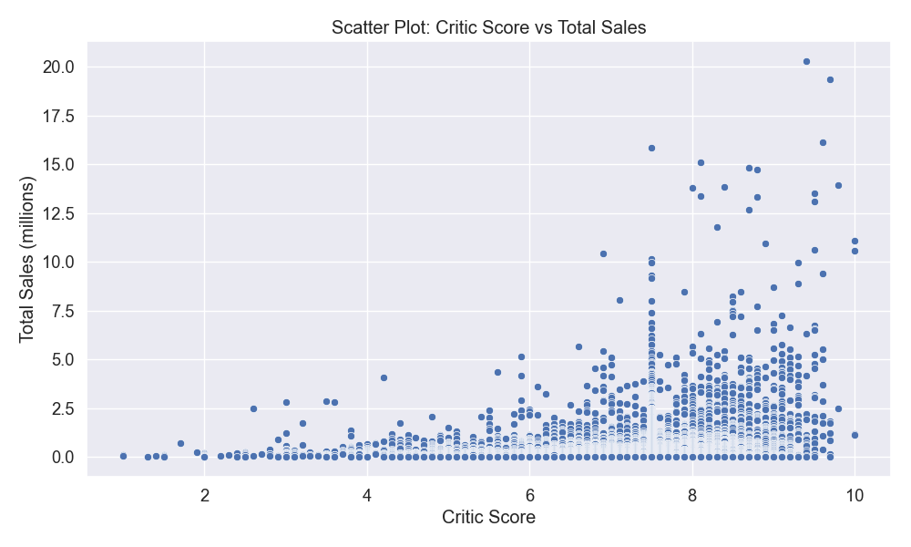
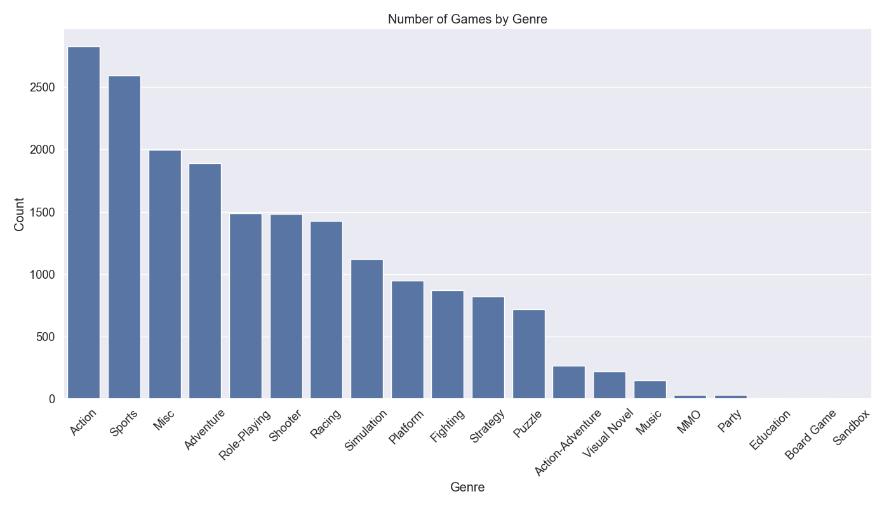
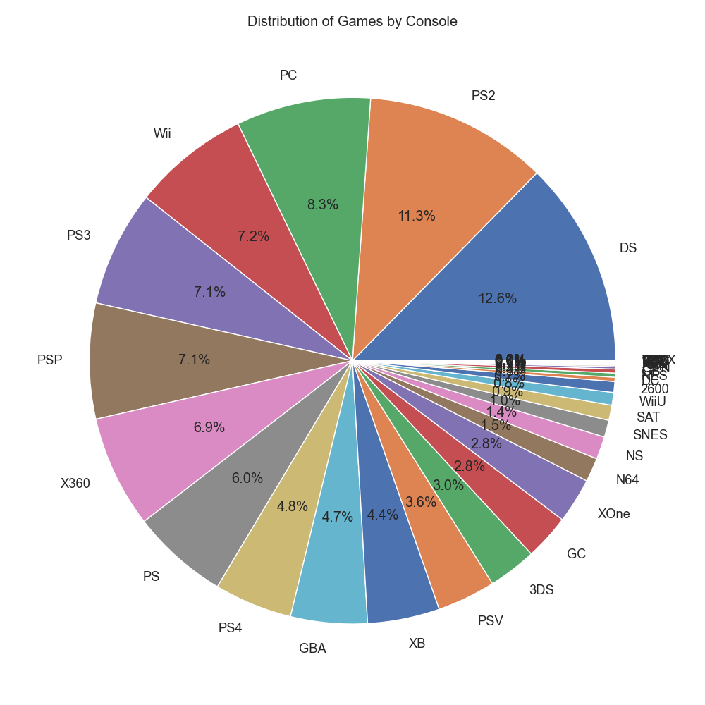

# Video Game Sales Analysis Report
## Statistical Analysis and Visual Representations

### Introduction
This report presents the results of analyzing the VGChartz video game sales dataset. The data contains 18,874 records with 14 variables that provide information about video game titles, platforms, sales figures across different regions, critic scores, and release information.

### Environment Setup and Data Loading Code

```python
import pandas as pd
import numpy as np
import matplotlib.pyplot as plt
import seaborn as sns
import scipy.stats as stats
from sklearn.preprocessing import LabelEncoder
import os

# Set style for plots
plt.style.use('ggplot')
sns.set(font_scale=1.2)

# Create output directory for plots
os.makedirs('plots', exist_ok=True)

# Load the dataset
df = pd.read_csv('vgchartz_cleaned.csv')

# Basic info and statistical summary
print("Dataset Shape:", df.shape)
print("\nData Types:")
print(df.dtypes)

# Check for missing values
print("\nMissing Values:")
print(df.isnull().sum())
```

This code imports necessary libraries and creates a directory for saving plots. It then loads the dataset and displays initial information such as dimensions, data types, and missing values.

### Identifying Variable Types

```python
# Convert release_year to numeric if needed
if df['release_year'].dtype == 'object':
    df['release_year'] = pd.to_numeric(df['release_year'], errors='coerce')

# Identify variable types
numeric_cols = df.select_dtypes(include=['int64', 'float64']).columns.tolist()
categorical_cols = df.select_dtypes(include=['object', 'category']).columns.tolist()

print("\nNumeric columns:", numeric_cols)
print("\nCategorical columns:", categorical_cols)

# Function to identify data type
def identify_variable_type(col):
    if df[col].dtype == 'object':
        unique_values = df[col].nunique()
        if unique_values == 2:
            return "Binary"
        elif unique_values <= 10:
            return "Nominal" if not all(df[col].dropna().astype(str).str.isnumeric()) else "Ordinal"
        else:
            return "Nominal"
    else:  # numeric
        unique_values = df[col].nunique()
        if unique_values == 2:
            return "Binary"
        elif unique_values <= 10:
            return "Ordinal"
        else:
            return "Numeric (Continuous)"

# Identify variable types
print("\nVariable Types:")
for col in df.columns:
    print(f"{col}: {identify_variable_type(col)}")
```

This section separates variables into numeric and categorical types. The `identify_variable_type` function further classifies each variable as binary, nominal, ordinal, or continuous numeric. This classification helps determine appropriate analysis methods for each variable.

### Data Structure
The dataset includes various types of variables:

#### Continuous Numeric Variables
- critic_score: Game ratings by critics (1-10 scale)
- total_sales: Total global sales in millions of units
- na_sales: North American sales in millions of units
- jp_sales: Japanese sales in millions of units
- pal_sales: European (PAL) sales in millions of units
- other_sales: Sales in other regions in millions of units
- release_year: Year the game was released

#### Nominal Variables
- title: Name of the game
- console: Gaming platform/console
- genre: Game genre (Action, Sports, RPG, etc.)
- publisher: Company that published the game
- developer: Company that developed the game
- release_date: Full date of game release
- last_update: Date when sales data was last updated

### Descriptive Statistics Calculation

```python
# Calculate statistics for numeric variables
def calculate_statistics(df, column):
    if column in df.columns:
        data = df[column].dropna()
        
        if pd.api.types.is_numeric_dtype(data):
            # Calculate statistics
            mean = data.mean()
            median = data.median()
            mode = data.mode()[0]
            midrange = (data.max() + data.min()) / 2
            q1 = data.quantile(0.25)
            q3 = data.quantile(0.75)
            min_val = data.min()
            max_val = data.max()
            
            print(f"\nStatistics for {column}:")
            print(f"Mean: {mean}")
            print(f"Median: {median}")
            print(f"Mode: {mode}")
            print(f"Midrange: {midrange}")
            print(f"Five Number Summary:")
            print(f"  Minimum: {min_val}")
            print(f"  Q1: {q1}")
            print(f"  Median: {median}")
            print(f"  Q3: {q3}")
            print(f"  Maximum: {max_val}")
```

This function calculates key descriptive statistics for numeric variables:
- Mean: Sum of values divided by count
- Median: Middle value of sorted data
- Mode: Most frequently occurring value
- Midrange: Average of minimum and maximum values
- Five-number summary: Minimum, first quartile, median, third quartile, maximum

These statistics provide insights into the central tendency, dispersion, and shape of the data distributions.

### Key Descriptive Statistics

#### Critic Score
- Mean: 7.41
- Median: 7.50
- Mode: 7.50
- Midrange: 5.50
- Five Number Summary:
  - Minimum: 1.00
  - Q1: 7.50
  - Median: 7.50
  - Q3: 7.50
  - Maximum: 10.00

#### Total Sales (millions)
- Mean: 0.35
- Median: 0.12
- Mode: 0.01
- Midrange: 10.16
- Five Number Summary:
  - Minimum: 0.00
  - Q1: 0.03
  - Median: 0.12
  - Q3: 0.35
  - Maximum: 20.32

#### North American Sales (millions)
- Mean: 0.26
- Median: 0.12
- Mode: 0.04
- Midrange: 4.88
- Five Number Summary:
  - Minimum: 0.00
  - Q1: 0.02
  - Median: 0.04
  - Q3: 0.12
  - Maximum: 9.76

#### Release Year
- Mean: 2007.69
- Median: 2008.00
- Mode: 2009.00
- Midrange: 1998.50
- Five Number Summary:
  - Minimum: 1977.00
  - Q1: 2004.00
  - Median: 2008.00
  - Q3: 2011.00
  - Maximum: 2020.00

### Creating 12 Different Visualizations

```python
def create_plots(df):
    # 1. Histogram for total_sales
    plt.figure(figsize=(10, 6))
    sns.histplot(df['total_sales'], kde=True)
    plt.title('Histogram of Total Game Sales')
    plt.xlabel('Total Sales (millions)')
    plt.ylabel('Frequency')
    plt.tight_layout()
    plt.savefig('plots/1_histogram_total_sales.png')
    plt.close()
    
    # 2-12. [More plots are created in the full function...]
```

This comprehensive function creates 12 different types of visualizations to explore different aspects of the video game sales data. Each visualization serves a specific analytical purpose.

### Analysis of Visualizations

#### 1. Histogram of Total Sales


This histogram shows the distribution of total game sales. The distribution is heavily right-skewed, indicating that most games have relatively low sales (under 1 million units), while a small number of blockbuster titles achieve extremely high sales. This exemplifies the hit-driven nature of the video game industry.

#### 2. Box Plot of Regional Sales


The box plot compares sales distributions across different regions. North American sales show the highest median and more extreme outliers, followed by PAL (Europe) regions, then Japan, and finally other regions. This demonstrates the relative size and importance of each market in the global video game industry.

#### 3. Q-Q Plot of Critic Scores


This plot compares the distribution of critic scores against a normal distribution. The significant deviations from the diagonal line indicate that critic scores are not normally distributed. The plateaus in the curve suggest that critics tend to give certain rounded scores (like 7.0, 7.5, 8.0) more frequently than others.

#### 4. Correlation Heatmap


The correlation heatmap reveals relationships between numeric variables:
- Strong positive correlations (0.71-0.97) between different regional sales metrics, suggesting that games popular in one region tend to be popular globally
- Weak positive correlation (0.21) between critic scores and total sales, indicating that higher-rated games tend to sell somewhat better
- Minimal correlation between release year and other variables, suggesting that the age of a game has little relationship with its sales or critical reception

#### 5. Scatter Plot: Critic Score vs. Total Sales


This scatter plot explores the relationship between critic scores and total sales. While there is a slight positive trend, the wide dispersion suggests that critical acclaim is not a strong predictor of commercial success. Many highly-rated games achieve modest sales, while some games with average ratings become commercial blockbusters.

#### 6. Bar Chart of Game Genres


The bar chart displays the number of games in each genre. Action games are the most common, followed by Sports and Role-Playing games. This reflects industry production trends and consumer preferences over the years covered in the dataset.

#### 7. Pie Chart of Console Distribution


This pie chart shows the proportion of games released on different consoles. The diversity of platforms highlights the fragmented nature of the gaming market, with titles spread across multiple competing platforms and generations of hardware.

#### 8. Violin Plot of Sales by Genre


The violin plot shows the distribution of total sales across different genres. The width of each "violin" indicates the density of data points at that sales level. Action, shooter, and sports games show higher sales potential with longer upper tails, while puzzle and strategy games tend to have lower median sales.

#### 9. Quantile Plot of Total Sales


This empirical cumulative distribution function (ECDF) plot shows the proportion of games that achieve any given sales figure. The steep initial curve indicates that about 80% of games sell fewer than 0.5 million copies, while the long tail represents the few blockbuster titles that achieve exceptional sales.

#### 10. Pair Plot of Regional Sales


This matrix of scatter plots shows relationships between sales in different regions and critic scores. The diagonal shows the distribution of each variable, while off-diagonal plots show relationships between pairs of variables. The plots reveal regional preferences and how sales patterns differ across global markets.

#### 11. Line Plot of Game Releases by Year


This time series plot shows the number of game releases per year. The trend reveals industry growth cycles, peak periods of production, and potential market saturation points. The decline in more recent years may reflect either industry contraction or incomplete data collection for newer titles.

#### 12. Heatmap of Genre Popularity Over Time


This heatmap visualizes how the popularity of different genres has evolved over time. Darker colors indicate more releases in a particular genre during a specific year. This visualization helps identify shifting industry trends, such as the rise of certain genres and the decline of others across gaming history.

### Top Publishers and Games

#### Top 10 Publishers by Total Sales
1. Activision: 722.77 million units
2. Electronic Arts: 644.13 million units
3. EA Sports: 485.66 million units
4. Ubisoft: 462.32 million units
5. THQ: 320.89 million units
6. Sony Computer Entertainment: 307.24 million units
7. Rockstar Games: 239.67 million units
8. Konami: 210.12 million units
9. Sega: 206.35 million units
10. Nintendo: 139.50 million units

#### Top 10 Best-Selling Games
1. Grand Theft Auto V (PS3): 20.32 million units
2. Grand Theft Auto V (PS4): 19.39 million units
3. Grand Theft Auto: Vice City (PS2): 16.15 million units
4. Grand Theft Auto V (X360): 15.86 million units
5. Call of Duty: Black Ops 3 (PS4): 15.09 million units
6. Call of Duty: Modern Warfare 3 (X360): 14.82 million units
7. Call of Duty: Black Ops (X360): 14.74 million units
8. Red Dead Redemption 2 (PS4): 13.94 million units
9. Call of Duty: Black Ops II (X360): 13.86 million units
10. Call of Duty: Black Ops II (PS3): 13.80 million units

### Conclusion
Based on the analyses performed, we can draw several conclusions about the video game industry:

1. **Market Distribution**: North America represents the largest market for video game sales, followed by Europe (PAL regions), Japan, and other regions. This regional hierarchy has significant implications for game development and publishing strategies.

2. **Sales Distribution**: The video game industry exhibits a pronounced "long tail" distribution, where a small number of blockbuster titles account for a disproportionate share of total sales. Most games (approximately 80%) sell fewer than 0.5 million units globally.

3. **Genre Trends**: Action games dominate the market in terms of quantity, followed by Sports and Role-Playing games. However, action and shooter games tend to achieve higher sales figures on average.

4. **Critical Reception**: The average critic score is 7.41 out of 10, with most games clustered around 7.5. There is only a modest correlation (0.21) between critic scores and commercial success, suggesting that factors beyond quality ratings drive sales performance.

5. **Publisher Concentration**: The industry shows significant publisher concentration, with the top 10 publishers accounting for a substantial portion of total sales. Activision, Electronic Arts, and EA Sports lead the market in terms of total unit sales.

6. **Franchise Power**: The top-selling games list is dominated by a few key franchises, particularly Grand Theft Auto and Call of Duty, highlighting the importance of established intellectual property in driving exceptional sales figures.

7. **Platform Fragmentation**: Games are distributed across numerous platforms, creating a fragmented market that requires publishers to make strategic decisions about which platforms to target for their releases.

8. **Release Trends**: Game release volumes have varied significantly over time, showing the cyclical nature of the industry often tied to console generation cycles.

These insights provide valuable information for understanding historical trends in the video game industry and could inform strategic decision-making for developers, publishers, and investors in the gaming sector. 