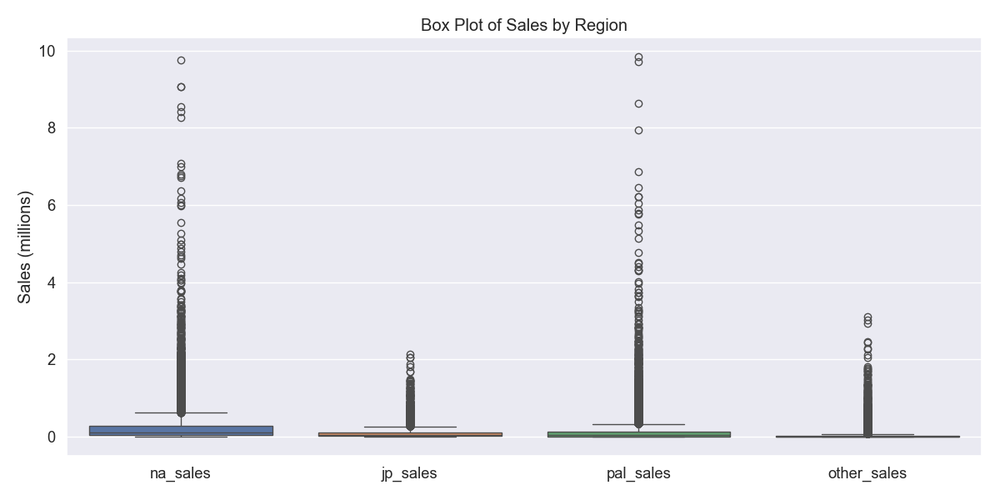
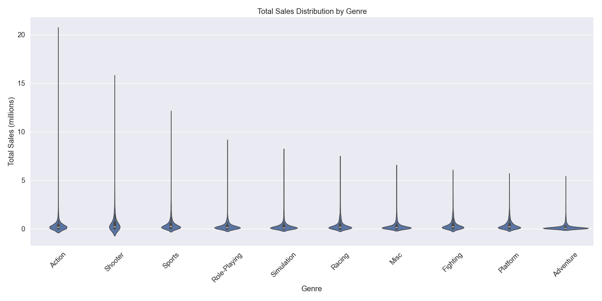
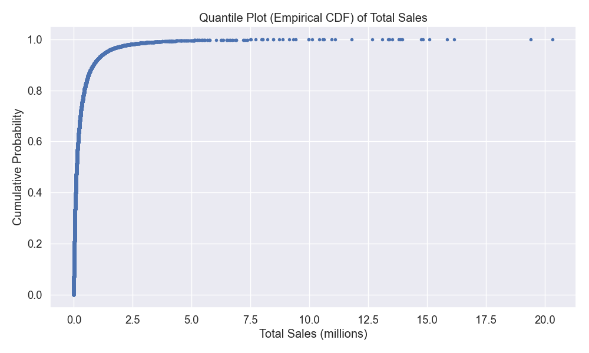
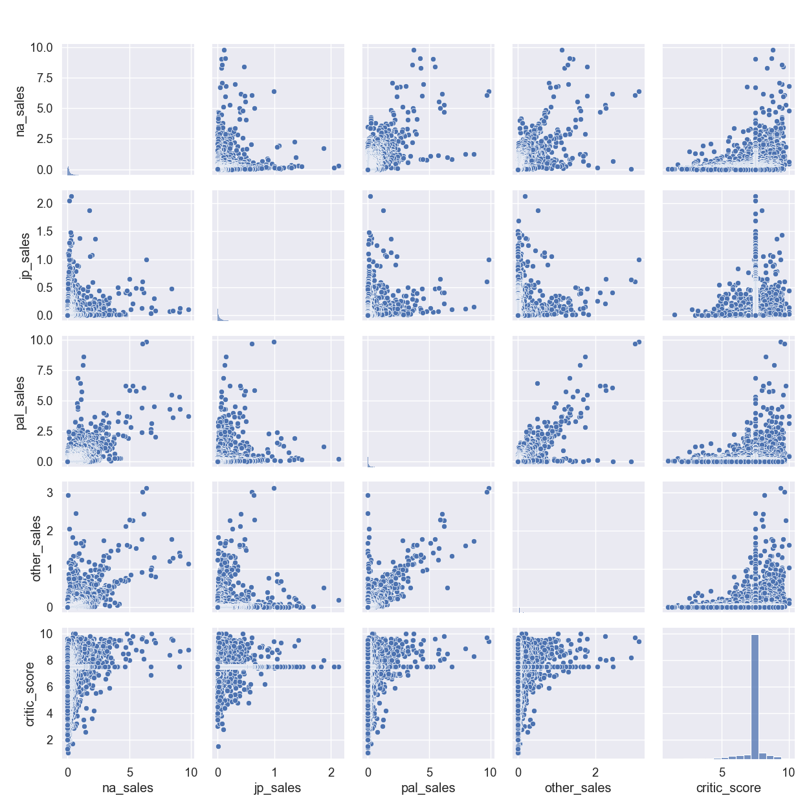
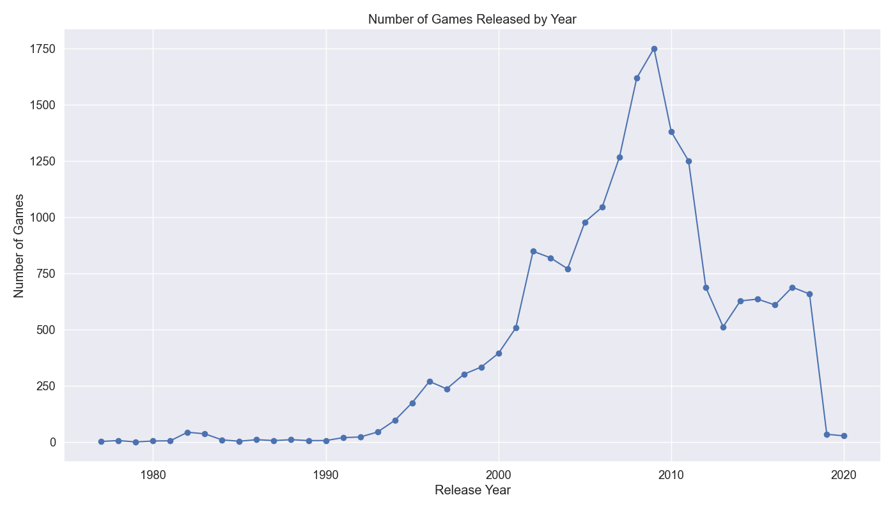
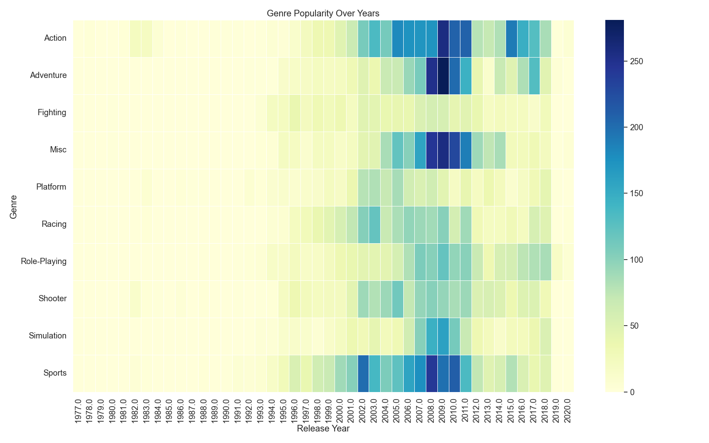

# گزارش تحلیل فروش بازی‌های ویدیویی
## تحلیل آماری و نمایش‌های تصویری

### مقدمه
این گزارش نتایج تحلیل مجموعه داده فروش بازی‌های ویدیویی VGChartz را ارائه می‌دهد. این داده‌ها شامل ۱۸،۸۷۴ رکورد با ۱۴ متغیر است که اطلاعاتی درباره عناوین بازی‌های ویدیویی، پلتفرم‌ها، آمار فروش در مناطق مختلف، امتیازات منتقدان و اطلاعات انتشار را ارائه می‌دهد.

### کد آماده‌سازی محیط و بارگذاری داده‌ها

```python
import pandas as pd
import numpy as np
import matplotlib.pyplot as plt
import seaborn as sns
import scipy.stats as stats
from sklearn.preprocessing import LabelEncoder
import os

# تنظیم استایل برای نمودارها
plt.style.use('ggplot')
sns.set(font_scale=1.2)

# ایجاد پوشه برای ذخیره نمودارها
os.makedirs('plots', exist_ok=True)

# بارگذاری مجموعه داده
df = pd.read_csv('vgchartz_cleaned.csv')

# اطلاعات پایه و خلاصه آماری
print("Dataset Shape:", df.shape)
print("\nData Types:")
print(df.dtypes)

# بررسی مقادیر گمشده
print("\nMissing Values:")
print(df.isnull().sum())
```

این کد کتابخانه‌های مورد نیاز را وارد می‌کند و پوشه‌ای برای ذخیره نمودارها ایجاد می‌کند. سپس مجموعه داده را بارگذاری کرده و اطلاعات اولیه مانند ابعاد، انواع داده‌ها، و مقادیر گمشده را نمایش می‌دهد.

### شناسایی نوع متغیرها

```python
# تبدیل سال انتشار به عددی در صورت نیاز
if df['release_year'].dtype == 'object':
    df['release_year'] = pd.to_numeric(df['release_year'], errors='coerce')

# شناسایی متغیرهای عددی و کیفی
numeric_cols = df.select_dtypes(include=['int64', 'float64']).columns.tolist()
categorical_cols = df.select_dtypes(include=['object', 'category']).columns.tolist()

print("\nNumeric columns:", numeric_cols)
print("\nCategorical columns:", categorical_cols)

# تابع تشخیص نوع متغیر
def identify_variable_type(col):
    if df[col].dtype == 'object':
        unique_values = df[col].nunique()
        if unique_values == 2:
            return "Binary"
        elif unique_values <= 10:
            return "Nominal" if not all(df[col].dropna().astype(str).str.isnumeric()) else "Ordinal"
        else:
            return "Nominal"
    else:  # numeric
        unique_values = df[col].nunique()
        if unique_values == 2:
            return "Binary"
        elif unique_values <= 10:
            return "Ordinal"
        else:
            return "Numeric (Continuous)"

# شناسایی نوع متغیرها
print("\nVariable Types:")
for col in df.columns:
    print(f"{col}: {identify_variable_type(col)}")
```

این بخش از کد به تفکیک متغیرها به دو گروه عددی و کیفی می‌پردازد. تابع `identify_variable_type` برای تشخیص نوع دقیق‌تر متغیرها (باینری، اسمی، ترتیبی یا پیوسته) استفاده می‌شود. این طبقه‌بندی به تعیین روش‌های مناسب تحلیل برای هر متغیر کمک می‌کند.

### ساختار داده‌ها
مجموعه داده شامل انواع مختلفی از متغیرها است:

#### متغیرهای عددی پیوسته
- امتیاز منتقدان (critic_score): امتیازدهی بازی‌ها توسط منتقدان (مقیاس ۱-۱۰)
- فروش کل (total_sales): فروش جهانی کل بر حسب میلیون نسخه
- فروش آمریکای شمالی (na_sales): فروش در آمریکای شمالی بر حسب میلیون نسخه
- فروش ژاپن (jp_sales): فروش در ژاپن بر حسب میلیون نسخه
- فروش اروپا (pal_sales): فروش در مناطق اروپا (PAL) بر حسب میلیون نسخه
- فروش در سایر مناطق (other_sales): فروش در سایر مناطق بر حسب میلیون نسخه
- سال انتشار (release_year): سالی که بازی منتشر شده است

#### متغیرهای اسمی
- عنوان (title): نام بازی
- کنسول (console): پلتفرم/کنسول بازی
- ژانر (genre): ژانر بازی (اکشن، ورزشی، نقش‌آفرینی و غیره)
- ناشر (publisher): شرکتی که بازی را منتشر کرده است
- سازنده (developer): شرکتی که بازی را توسعه داده است
- تاریخ انتشار (release_date): تاریخ کامل انتشار بازی
- آخرین به‌روزرسانی (last_update): تاریخی که آمار فروش آخرین بار به‌روزرسانی شده است

### محاسبه آمار توصیفی

```python
# محاسبه آمار توصیفی برای متغیرهای عددی
def calculate_statistics(df, column):
    if column in df.columns:
        data = df[column].dropna()
        
        if pd.api.types.is_numeric_dtype(data):
            # محاسبه آماره‌ها
            mean = data.mean()
            median = data.median()
            mode = data.mode()[0]
            midrange = (data.max() + data.min()) / 2
            q1 = data.quantile(0.25)
            q3 = data.quantile(0.75)
            min_val = data.min()
            max_val = data.max()
            
            print(f"\nStatistics for {column}:")
            print(f"Mean: {mean}")
            print(f"Median: {median}")
            print(f"Mode: {mode}")
            print(f"Midrange: {midrange}")
            print(f"Five Number Summary:")
            print(f"  Minimum: {min_val}")
            print(f"  Q1: {q1}")
            print(f"  Median: {median}")
            print(f"  Q3: {q3}")
            print(f"  Maximum: {max_val}")
```

این تابع آمار توصیفی کلیدی برای متغیرهای عددی را محاسبه می‌کند:
- میانگین (mean): مجموع مقادیر تقسیم بر تعداد آنها
- میانه (median): مقدار وسط داده‌های مرتب شده
- مد (mode): مقداری که بیشترین فراوانی را دارد
- میان‌دامنه (midrange): میانگین کمترین و بیشترین مقدار
- خلاصه پنج عددی: کمینه، چارک اول، میانه، چارک سوم، بیشینه

این آماره‌ها بینش‌هایی درباره گرایش مرکزی، پراکندگی و شکل توزیع‌های داده ارائه می‌دهند.

### آمار توصیفی متغیرهای کلیدی

#### امتیاز منتقدان
- میانگین: ۷.۴۱
- میانه: ۷.۵۰
- مد: ۷.۵۰
- میان‌دامنه: ۵.۵۰
- خلاصه پنج عددی:
  - کمینه: ۱.۰۰
  - چارک اول: ۷.۵۰
  - میانه: ۷.۵۰
  - چارک سوم: ۷.۵۰
  - بیشینه: ۱۰.۰۰

#### فروش کل (میلیون نسخه)
- میانگین: ۰.۳۵
- میانه: ۰.۱۲
- مد: ۰.۰۱
- میان‌دامنه: ۱۰.۱۶
- خلاصه پنج عددی:
  - کمینه: ۰.۰۰
  - چارک اول: ۰.۰۳
  - میانه: ۰.۱۲
  - چارک سوم: ۰.۳۵
  - بیشینه: ۲۰.۳۲

#### فروش آمریکای شمالی (میلیون نسخه)
- میانگین: ۰.۲۶
- میانه: ۰.۱۲
- مد: ۰.۰۴
- میان‌دامنه: ۴.۸۸
- خلاصه پنج عددی:
  - کمینه: ۰.۰۰
  - چارک اول: ۰.۰۲
  - میانه: ۰.۰۴
  - چارک سوم: ۰.۱۲
  - بیشینه: ۹.۷۶

#### سال انتشار
- میانگین: ۲۰۰۷.۶۹
- میانه: ۲۰۰۸.۰۰
- مد: ۲۰۰۹.۰۰
- میان‌دامنه: ۱۹۹۸.۵۰
- خلاصه پنج عددی:
  - کمینه: ۱۹۷۷.۰۰
  - چارک اول: ۲۰۰۴.۰۰
  - میانه: ۲۰۰۸.۰۰
  - چارک سوم: ۲۰۱۱.۰۰
  - بیشینه: ۲۰۲۰.۰۰

### ایجاد ۱۲ نمودار مختلف

```python
def create_plots(df):
    # 1. هیستوگرام برای فروش کل
    plt.figure(figsize=(10, 6))
    sns.histplot(df['total_sales'], kde=True)
    plt.title('Histogram of Total Game Sales')
    plt.xlabel('Total Sales (millions)')
    plt.ylabel('Frequency')
    plt.tight_layout()
    plt.savefig('plots/1_histogram_total_sales.png')
    plt.close()
    
    # 2-12. [نمودارهای بیشتر در تابع کامل ایجاد می‌شوند...]
```

این تابع جامع ۱۲ نوع مختلف نمودار را برای بررسی جنبه‌های مختلف داده‌های فروش بازی‌های ویدیویی ایجاد می‌کند. هر نمودار هدف تحلیلی خاصی دارد.

### تحلیل نمودارها

#### ۱. هیستوگرام فروش کل


این هیستوگرام توزیع فروش کل بازی‌ها را نشان می‌دهد. توزیع به شدت چوله به راست است، که نشان می‌دهد اکثر بازی‌ها فروش نسبتاً کمی دارند (کمتر از ۱ میلیون نسخه)، در حالی که تعداد کمی از عناوین پرفروش به فروش بسیار بالایی دست می‌یابند. این موضوع نشان‌دهنده ماهیت وابسته به محبوبیت در صنعت بازی‌های ویدیویی است.

#### ۲. نمودار جعبه‌ای فروش منطقه‌ای


نمودار جعبه‌ای توزیع فروش در مناطق مختلف را مقایسه می‌کند. فروش آمریکای شمالی بالاترین میانه و مقادیر پرت بیشتری را نشان می‌دهد، پس از آن مناطق اروپا (PAL)، سپس ژاپن و در نهایت سایر مناطق قرار دارند. این موضوع اهمیت نسبی هر بازار در صنعت جهانی بازی‌های ویدیویی را نشان می‌دهد.

#### ۳. نمودار Q-Q برای امتیازات منتقدان


این نمودار توزیع امتیازات منتقدان را با توزیع نرمال مقایسه می‌کند. انحراف‌های قابل توجه از خط قطری نشان می‌دهد که امتیازات منتقدان توزیع نرمال ندارند. فلات‌های موجود در منحنی نشان می‌دهد که منتقدان تمایل دارند امتیازات گرد شده خاصی (مانند ۷.۰، ۷.۵، ۸.۰) را بیشتر از سایر امتیازات بدهند.

#### ۴. نمودار همبستگی


نمودار همبستگی روابط بین متغیرهای عددی را نشان می‌دهد:
- همبستگی مثبت قوی (۰.۷۱-۰.۹۷) بین معیارهای فروش منطقه‌ای مختلف، که نشان می‌دهد بازی‌های محبوب در یک منطقه تمایل دارند به طور جهانی نیز محبوب باشند
- همبستگی مثبت ضعیف (۰.۲۱) بین امتیازات منتقدان و فروش کل، که نشان می‌دهد بازی‌های با امتیاز بالاتر تا حدودی فروش بهتری دارند
- همبستگی حداقل بین سال انتشار و سایر متغیرها، که نشان می‌دهد سن یک بازی رابطه کمی با فروش یا پذیرش منتقدان آن دارد

#### ۵. نمودار پراکندگی: امتیاز منتقدان در مقابل فروش کل


این نمودار پراکندگی رابطه بین امتیازات منتقدان و فروش کل را بررسی می‌کند. با وجود روند مثبت اندک، پراکندگی گسترده نشان می‌دهد که تحسین منتقدان پیش‌بینی‌کننده قوی موفقیت تجاری نیست. بسیاری از بازی‌های با امتیاز بالا فروش متوسطی دارند، در حالی که برخی بازی‌ها با امتیازات متوسط به موفقیت‌های تجاری بزرگ تبدیل می‌شوند.

#### ۶. نمودار میله‌ای ژانرهای بازی


نمودار میله‌ای تعداد بازی‌ها در هر ژانر را نشان می‌دهد. بازی‌های اکشن بیشترین تعداد را دارند، پس از آن بازی‌های ورزشی و نقش‌آفرینی قرار دارند. این موضوع روندهای تولید صنعت و ترجیحات مصرف‌کنندگان در طول سال‌های پوشش داده شده در مجموعه داده را منعکس می‌کند.

#### ۷. نمودار دایره‌ای توزیع کنسول‌ها


این نمودار دایره‌ای نسبت بازی‌های منتشر شده روی کنسول‌های مختلف را نشان می‌دهد. تنوع پلتفرم‌ها ماهیت چندپاره بازار بازی را برجسته می‌کند، با عناوینی که در چندین پلتفرم رقیب و نسل‌های مختلف سخت‌افزار منتشر شده‌اند.

#### ۸. نمودار ویولن فروش بر اساس ژانر


نمودار ویولن توزیع فروش کل در ژانرهای مختلف را نشان می‌دهد. پهنای هر "ویولن" نشان‌دهنده تراکم نقاط داده در آن سطح فروش است. بازی‌های اکشن، تیراندازی و ورزشی پتانسیل فروش بالاتری با دنباله‌های بالایی طولانی‌تر نشان می‌دهند، در حالی که بازی‌های پازل و استراتژی تمایل به میانه فروش پایین‌تری دارند.

#### ۹. نمودار چندک فروش کل


این نمودار تابع توزیع تجمعی تجربی (ECDF) نسبت بازی‌هایی را نشان می‌دهد که به هر رقم فروشی دست می‌یابند. منحنی اولیه تند نشان می‌دهد که حدود ۸۰٪ بازی‌ها کمتر از ۰.۵ میلیون نسخه می‌فروشند، در حالی که دنباله طولانی نشان‌دهنده تعداد کمی از عناوین پرفروش است که به فروش استثنایی دست می‌یابند.

#### ۱۰. نمودار جفتی فروش منطقه‌ای


این ماتریس نمودارهای پراکندگی روابط بین فروش در مناطق مختلف و امتیازات منتقدان را نشان می‌دهد. قطر توزیع هر متغیر را نشان می‌دهد، در حالی که نمودارهای خارج از قطر روابط بین جفت‌های متغیرها را نشان می‌دهند. این نمودارها ترجیحات منطقه‌ای و چگونگی تفاوت الگوهای فروش در بازارهای جهانی را نشان می‌دهند.

#### ۱۱. نمودار خطی عرضه بازی‌ها بر اساس سال


این نمودار سری زمانی تعداد عرضه بازی‌ها در هر سال را نشان می‌دهد. روند چرخه‌های رشد صنعت، دوره‌های اوج تولید و نقاط احتمالی اشباع بازار را نشان می‌دهد. کاهش در سال‌های اخیر ممکن است نشان‌دهنده انقباض صنعت یا جمع‌آوری ناقص داده‌ها برای عناوین جدیدتر باشد.

#### ۱۲. نمودار حرارتی محبوبیت ژانر در طول زمان


این نمودار حرارتی نشان می‌دهد که چگونه محبوبیت ژانرهای مختلف در طول زمان تکامل یافته است. رنگ‌های تیره‌تر نشان‌دهنده انتشارات بیشتر در یک ژانر خاص در یک سال مشخص است. این تصویرسازی به شناسایی روندهای متغیر صنعت، مانند ظهور ژانرهای خاص و افول برخی دیگر در تاریخ بازی کمک می‌کند.

### ناشران برتر و بازی‌ها

#### ۱۰ ناشر برتر بر اساس فروش کل
1. اکتیویژن (Activision): ۷۲۲.۷۷ میلیون نسخه
2. الکترونیک آرتز (Electronic Arts): ۶۴۴.۱۳ میلیون نسخه
3. ای‌ای اسپورتس (EA Sports): ۴۸۵.۶۶ میلیون نسخه
4. یوبی‌سافت (Ubisoft): ۴۶۲.۳۲ میلیون نسخه
5. تی‌اچ‌کیو (THQ): ۳۲۰.۸۹ میلیون نسخه
6. سونی کامپیوتر انترتینمنت (Sony Computer Entertainment): ۳۰۷.۲۴ میلیون نسخه
7. راک‌استار گیمز (Rockstar Games): ۲۳۹.۶۷ میلیون نسخه
8. کونامی (Konami): ۲۱۰.۱۲ میلیون نسخه
9. سگا (Sega): ۲۰۶.۳۵ میلیون نسخه
10. نینتندو (Nintendo): ۱۳۹.۵۰ میلیون نسخه

#### ۱۰ بازی پرفروش
1. گرند تفت آتو وی (Grand Theft Auto V) (PS3): ۲۰.۳۲ میلیون نسخه
2. گرند تفت آتو وی (Grand Theft Auto V) (PS4): ۱۹.۳۹ میلیون نسخه
3. گرند تفت آتو: وایس سیتی (Grand Theft Auto: Vice City) (PS2): ۱۶.۱۵ میلیون نسخه
4. گرند تفت آتو وی (Grand Theft Auto V) (X360): ۱۵.۸۶ میلیون نسخه
5. کال آو دیوتی: بلک آپس ۳ (Call of Duty: Black Ops 3) (PS4): ۱۵.۰۹ میلیون نسخه
6. کال آو دیوتی: مدرن وارفر ۳ (Call of Duty: Modern Warfare 3) (X360): ۱۴.۸۲ میلیون نسخه
7. کال آو دیوتی: بلک آپس (Call of Duty: Black Ops) (X360): ۱۴.۷۴ میلیون نسخه
8. رد دد ریدمپشن ۲ (Red Dead Redemption 2) (PS4): ۱۳.۹۴ میلیون نسخه
9. کال آو دیوتی: بلک آپس ۲ (Call of Duty: Black Ops II) (X360): ۱۳.۸۶ میلیون نسخه
10. کال آو دیوتی: بلک آپس ۲ (Call of Duty: Black Ops II) (PS3): ۱۳.۸۰ میلیون نسخه

### نتیجه‌گیری
بر اساس تحلیل‌های انجام شده، می‌توان چندین نتیجه درباره صنعت بازی‌های ویدیویی استخراج کرد:

۱. **توزیع بازار**: آمریکای شمالی بزرگترین بازار فروش بازی‌های ویدیویی را تشکیل می‌دهد، پس از آن اروپا (مناطق PAL)، ژاپن و سایر مناطق قرار دارند. این سلسله مراتب منطقه‌ای تأثیرات قابل توجهی بر استراتژی‌های توسعه و انتشار بازی دارد.

۲. **توزیع فروش**: صنعت بازی‌های ویدیویی توزیع "دم دراز" مشخصی را نشان می‌دهد، جایی که تعداد کمی از عناوین پرفروش سهم نامتناسبی از کل فروش را به خود اختصاص می‌دهند. اکثر بازی‌ها (حدود ۸۰٪) کمتر از ۰.۵ میلیون نسخه در سطح جهانی می‌فروشند.

۳. **روندهای ژانر**: بازی‌های اکشن از نظر تعداد بر بازار تسلط دارند، پس از آن بازی‌های ورزشی و نقش‌آفرینی قرار دارند. با این حال، بازی‌های اکشن و تیراندازی به طور متوسط به ارقام فروش بالاتری دست می‌یابند.

۴. **پذیرش منتقدان**: میانگین امتیاز منتقدان ۷.۴۱ از ۱۰ است، با تمرکز اکثر بازی‌ها حول ۷.۵. تنها همبستگی متوسطی (۰.۲۱) بین امتیازات منتقدان و موفقیت تجاری وجود دارد، که نشان می‌دهد عوامل دیگری غیر از امتیازات کیفیت، عملکرد فروش را هدایت می‌کنند.

۵. **تمرکز ناشران**: صنعت تمرکز قابل توجهی از ناشران را نشان می‌دهد، با ۱۰ ناشر برتر که بخش قابل توجهی از کل فروش را به خود اختصاص می‌دهند. اکتیویژن، الکترونیک آرتز و ای‌ای اسپورتس از نظر فروش کل واحد در بازار پیشرو هستند.

۶. **قدرت فرنچایز**: لیست بازی‌های پرفروش توسط چند فرنچایز کلیدی، به ویژه گرند تفت آتو و کال آو دیوتی، تسلط دارد، که اهمیت مالکیت معنوی تثبیت شده در ایجاد ارقام فروش استثنایی را برجسته می‌کند.

۷. **چندپارگی پلتفرم**: بازی‌ها در پلتفرم‌های متعددی توزیع می‌شوند، که بازاری چندپاره ایجاد می‌کند که ناشران را ملزم می‌کند تصمیمات استراتژیکی درباره اینکه کدام پلتفرم‌ها را برای انتشار خود هدف قرار دهند، اتخاذ کنند.

۸. **روندهای انتشار**: حجم انتشار بازی‌ها در طول زمان تغییرات قابل توجهی داشته است، که نشان‌دهنده ماهیت دوره‌ای صنعت است که اغلب با چرخه‌های نسل کنسول مرتبط است.

این بینش‌ها اطلاعات ارزشمندی برای درک روندهای تاریخی در صنعت بازی‌های ویدیویی ارائه می‌دهند و می‌توانند تصمیم‌گیری استراتژیک برای توسعه‌دهندگان، ناشران و سرمایه‌گذاران در بخش بازی را هدایت کنند. 